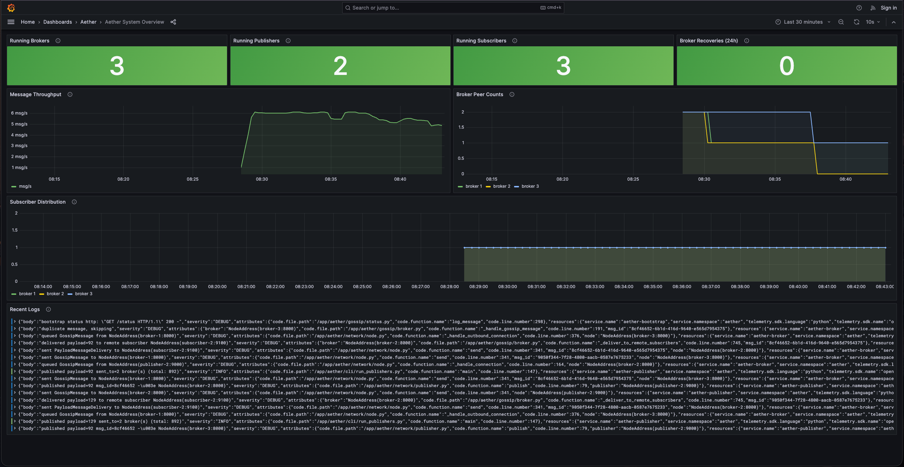
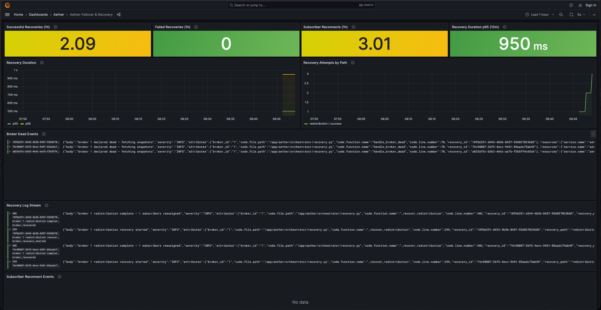
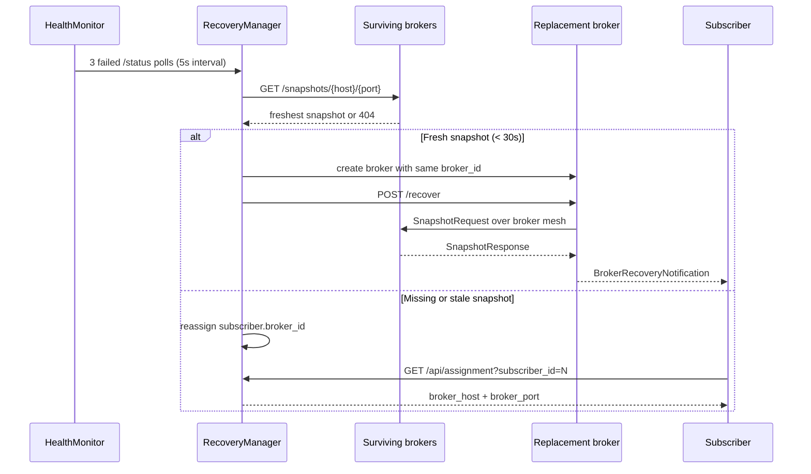
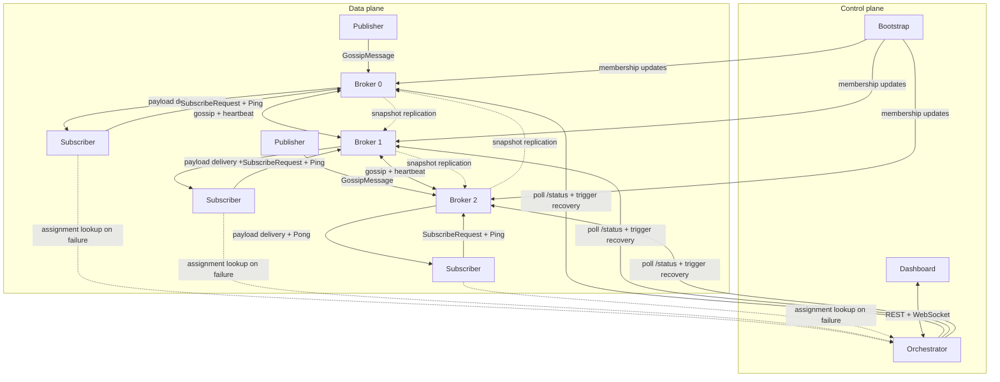

# Aether

Aether is a distributed pub-sub broker with Chandy-Lamport snapshot recovery — kill a broker, watch it recover.

Built from TCP sockets up: gossip-based message propagation across a broker mesh, consistent global snapshots for fault-tolerant state capture, automatic broker failover with two recovery paths, and a FastAPI orchestration control plane that manages Docker containers on the fly — all with a live React dashboard.

**No external message queue. No Kafka. No Redis. Built from TCP sockets up.**

---

## Recovery Demo

<video src="docs/media/Broker-Failover-Demo.mp4" controls width="720"></video>

Kill a broker, watch the orchestrator detect the failure, restore from snapshot or redistribute subscribers, and keep the system live.

If the clip does not play in your browser, open the file directly: [`Broker-Failover-Demo.mp4`](docs/media/Broker-Failover-Demo.mp4).

---

## Observability Dashboards



Caption: System-wide metrics, component health, throughput, and live operational context in Grafana.



Caption: Recovery-focused dashboard for broker failures, recovery path outcomes, durations, and correlated logs.

---

## Quick Start

```bash
git clone https://github.com/krishmula/aether.git
cd aether
make demo
open http://localhost:3000
open http://localhost:3001
```

This builds the Docker images, starts the control plane plus the observability stack, and seeds a topology of **3 brokers, 2 publishers, 3 subscribers**.

- React dashboard: `http://localhost:3000`
- Grafana: `http://localhost:3001`
- Orchestrator API docs: `http://localhost:9000/docs`

When you're done:
```bash
make clean
```

---

## What Makes This Interesting

- **Gossip Protocol** — Messages propagate through the broker mesh via randomized gossip with configurable fanout and TTL. UUID deduplication prevents loops without a central coordinator.
- **Chandy-Lamport Snapshots** — Consistent global state capture across all brokers. The classic distributed systems algorithm, running for real, every 30 seconds. Snapshots are replicated to k=2 peers so they survive broker failure.
- **Automatic Broker Recovery** — When a broker dies, the orchestrator detects it within 15 seconds and chooses the best recovery path: replace the broker and restore full state from a fresh snapshot, or redistribute orphaned subscribers across surviving brokers.
- **Subscriber Autonomy** — Subscribers detect broker failure independently via Ping/Pong health checks, then query the orchestrator for their new assignment and reconnect with exponential backoff. No thundering herd.
- **Publisher Resilience** — Publishers track failed brokers and skip them during a 30s cooldown, retrying automatically after expiry.
- **Dynamic Orchestration** — A FastAPI control plane manages broker/publisher/subscriber containers via the Docker SDK. Spin up or tear down any component with a single API call while the system keeps running.
- **Observability Stack Included** — Every component exposes `/status`, the orchestrator exposes Prometheus `/metrics`, and structured logs flow through OpenTelemetry Collector → Loki → Grafana with provisioned dashboards for system overview and failover analysis.

---

## Architecture


---

## How Failover Works



**Path A (Replacement):** When a snapshot was taken within the last 30 seconds, Aether spins up a new broker with the same broker ID, calls `POST /recover`, and restores the dead broker's subscriber registrations, dedup history, and peer list. The replacement broker then pushes `BrokerRecoveryNotification` to known subscribers, while the pull-based assignment API remains the fallback path.

**Path B (Redistribution):** When no fresh snapshot is available, Aether reassigns orphaned subscribers to the surviving broker with the fewest current subscribers. Subscribers reconnect via the same pull-based assignment API. Message history is not restored, but the system stays live.

---

## How Chandy-Lamport Works (in 60 seconds)

The challenge with distributed snapshots: you can't just pause all nodes and read their state — by the time you read node B, node A has already changed.

Chandy-Lamport solves this with **markers**: a special message injected into every channel. When a node receives a marker, it records its current state and stops recording incoming messages on that channel. When all channels have a marker, the global snapshot is consistent.

In Aether:
1. The lead broker (lowest address) initiates a snapshot every 30 seconds.
2. It records its own state (subscribers, dedup history, peer list) and sends a `SnapshotMarker` to all peers.
3. Each peer records its state on first marker receipt, then forwards the marker.
4. Once all markers are acknowledged, each broker replicates its snapshot to k=2 random peers.
5. If that broker later dies, any peer that received a copy can serve it via `GET /snapshots/{host}/{port}`.

The replacement broker calls `POST /recover`, which fetches the snapshot from a peer and restores state — same subscribers, same dedup window, same peer list.

---

## Prerequisites

| Requirement | Version | Notes |
|---|---|---|
| Python | 3.13+ | Required for local and distributed modes |
| Docker | 24+ | Required for containerized mode |
| Docker Compose | v2 (`docker compose`) | Included with Docker Desktop |
| `make` | any | Optional but recommended |

```bash
python --version   # need 3.13+
docker --version
docker compose version
```

---

## All Setup Modes

### Mode 1 — Local (single process, no networking)

Everything in memory. No sockets, no Docker. Great for testing the core logic.

```bash
pip install -e ".[dev]"
aether-admin 4 --publish-interval 0.05 --duration 2 --seed 123
```

**Arguments:** number of subscribers, `--publish-interval` seconds, `--duration` seconds, `--seed` for reproducibility.

---

### Mode 2 — Distributed (all-in-one on localhost, real TCP)

All components run as separate threads with real TCP sockets on localhost.

```bash
pip install -e ".[dev]"
aether-distributed 3 2 2 --publish-interval 0.5 --duration 10 --seed 42
#                  │ │ └── 2 publishers
#                  │ └──── 2 subscribers per broker
#                  └────── 3 brokers

# or:
make distributed-demo
```

---

### Mode 3 — Docker (fully containerized, orchestrated)

The full setup. Bootstrap and orchestrator are compose-managed; all pub/sub components are created dynamically via the Docker SDK.

#### Step 1 — Build

```bash
make build
```

#### Step 2 — Start infrastructure

```bash
make up
make ps   # verify bootstrap, orchestrator, dashboard, otel-collector, loki, prometheus, grafana
```

#### Step 3 — Create topology

```bash
curl -X POST http://localhost:9000/api/seed
```

Or manually:

```bash
curl -X POST http://localhost:9000/api/brokers       # repeat 3×
curl -X POST http://localhost:9000/api/publishers \
  -H 'Content-Type: application/json' -d '{"interval": 0.5}'
curl -X POST http://localhost:9000/api/subscribers \
  -H 'Content-Type: application/json' -d '{"broker_id": 0}'
```

#### Step 4 — Explore

```bash
open http://localhost:3000          # React dashboard
open http://localhost:3001          # Grafana dashboards (anonymous access enabled)
open http://localhost:9000/docs     # Swagger UI
curl http://localhost:9000/api/state | python3 -m json.tool
```

#### Tear down

```bash
make clean   # stops compose services + all dynamic containers
```

---

### Mode 4 — Multi-machine (Tailscale / LAN)

Set Tailscale or LAN IPs in `config.yaml`:

```yaml
bootstrap:
  host: "100.x.x.10"
  port: 7000

brokers:
  - id: 1
    host: "100.x.x.34"
    port: 8000
```

```bash
export AETHER_CONFIG=/path/to/config.yaml
aether-bootstrap --host 100.x.x.10 --port 7000 --status-port 17000
aether-broker    --host 100.x.x.34 --port 8000 --status-port 18000 --broker-id 1
```

---

## Architecture



In Docker mode, each component keeps a fixed internal port and gets a unique host port mapping. Brokers listen on container TCP `8000` and status `18000`, publishers on `9000` and `19000`, and subscribers on `9100` and `19100`.

### Components

| Component | Role | Default Ports |
|---|---|---|
| **Bootstrap** | Peer discovery — brokers register here, receive membership updates | TCP `7000`, HTTP `17000` |
| **Broker** | Message routing, gossip relay, snapshot coordination, Ping/Pong | Container TCP `8000`, HTTP `18000` |
| **Publisher** | Generates `UInt8` messages, sends to N random brokers with dead-broker cooldown | Container TCP `9000`, HTTP `19000` |
| **Subscriber** | Receives messages matching its `[low, high]` payload range; detects dead broker via Ping | Container TCP `9100`, HTTP `19100` |
| **Orchestrator** | FastAPI control plane — health monitoring, recovery decisions, assignment registry | HTTP `9000` |
| **Dashboard** | React + D3 real-time visualization | HTTP `3000` |
| **OTel Collector** | Receives OTLP logs from Aether processes and forwards them to Loki | OTLP gRPC `4317`, OTLP HTTP `4318` |
| **Loki** | Structured log storage and LogQL query engine | HTTP `3100` |
| **Prometheus** | Scrapes orchestrator `/metrics` for recovery and health metrics | HTTP `9090` |
| **Grafana** | Pre-provisioned dashboards for metrics, logs, and failover investigation | HTTP `3001` |

### Message Flow

1. **Publisher** creates a `GossipMessage` with a UUID, TTL=5, and random `UInt8` payload; sends to N random brokers.
2. **Broker** deduplicates by UUID, delivers to local subscribers whose `PayloadRange` includes the payload, gossips to random peers (fanout=2, TTL decremented).
3. **Subscriber** receives `PayloadMessageDelivery`, increments `counts[payload]` in its 256-element array.

### Fault Tolerance

1. **Orchestrator health monitor** — polls each broker's `/status` every 5s. 3 consecutive failures → broker declared dead.
2. **Subscriber Ping/Pong** — subscribers independently ping their broker every 5s. 15s without a Pong → enter reconnect loop with exponential backoff + jitter.
3. **Snapshot replication** — each broker replicates its Chandy-Lamport snapshot to k=2 peers; surviving peers serve the snapshot via `GET /snapshots/{host}/{port}`.
4. **Path A (replacement)** — fresh snapshot (<30s old) → spin up replacement container, `POST /recover`, restore full state.
5. **Path B (redistribution)** — no fresh snapshot → reassign orphaned subscribers to least-loaded surviving brokers.
6. **Pull-based reassignment** — subscribers query `GET /api/assignment?subscriber_id=N` to learn their new broker. Missed push notifications are recovered naturally on next poll.

---

## Aether vs Production Systems

| Feature | Aether | Kafka | NATS JetStream |
|---|---|---|---|
| **Primary goal** | Demonstrate distributed systems concepts end-to-end | High-throughput durable log | Low-latency cloud-native messaging |
| **Failure detection** | HealthMonitor (HTTP polls) + Ping/Pong | ZooKeeper / KRaft session timeout | RAFT heartbeat |
| **State recovery** | Chandy-Lamport snapshot → replacement broker | Log replay from any replica | JetStream stream replication |
| **Subscriber reconnect** | Pull-based `/api/assignment` with backoff | Consumer group rebalance protocol | Client reconnect with server-side streams |
| **Persistence** | None (in-memory) | Durable log on disk | Durable streams on disk |
| **Production-grade** | No | Yes | Yes |
| **Lines of code** | ~3k | ~500k | ~200k |

Aether is a demo system, not a production message broker. It implements the same *concepts* — consistent snapshots, pull-based consumer assignment, hybrid recovery paths — using the same algorithmic foundations. The difference is operational maturity, persistence, and scale.

---

## Dashboard

The React dashboard connects to the orchestrator's WebSocket and REST API:

- **Topology Graph** — D3 force-directed graph of brokers, publishers, and subscribers with animated data flow edges. Brokers flash red on `BROKER_DECLARED_DEAD` events.
- **Metrics Panel** — Messages processed, active components, uptime, message rates.
- **Control Panel** — Add and remove brokers, publishers, and subscribers without leaving the browser.
- **Event Feed** — Real-time stream of `BROKER_DECLARED_DEAD`, `BROKER_RECOVERED`, `SUBSCRIBER_RECONNECTED` events.

Open http://localhost:3000 after `make demo` or `make up`.

---

## Observability

`make demo` and `make up` start the local observability stack alongside Aether:

```text
Aether processes
  -> structured JSON logs + OTLP export
  -> OTel Collector
  -> Loki
  -> Grafana

Orchestrator /metrics
  -> Prometheus
  -> Grafana
```

What you get out of the box:

- **Structured logs** from bootstrap, brokers, publishers, subscribers, and the orchestrator.
- **Stable event types** like `broker_declared_dead`, `broker_recovered`, `subscriber_reconnected`, `snapshot_started`, and `message_published`.
- **Prometheus metrics** for broker recovery counts, recovery duration, subscriber reassignments, component health, broker peer/subscriber counts, and aggregate published-message throughput.
- **Provisioned Grafana dashboards** in the `Aether` folder: `Aether System Overview` and `Aether Failover & Recovery`.

Default local endpoints:

| Service | URL |
|---|---|
| Grafana | `http://localhost:3001` |
| Prometheus | `http://localhost:9090` |
| Loki | `http://localhost:3100` |
| OTel Collector | `http://localhost:4318` |
| Orchestrator Prometheus scrape endpoint | `http://localhost:9000/metrics` |

Notes:

- Grafana is provisioned with anonymous viewer access, so there is no login step for the demo.
- In Docker mode, Aether components export logs to the collector via `logging.otel_endpoint` in [`config.docker.yaml`](/Users/krishna/dev/aether/config.docker.yaml).
- Loki stream labels stay low-cardinality: `service_name`, `component_type`, and `event_type`. Correlation fields like `recovery_id`, `snapshot_id`, and `msg_id` remain in the log body for LogQL filtering.

---

## Orchestrator API

Full interactive docs at http://localhost:9000/docs.

| Method | Endpoint | Description |
|---|---|---|
| `POST` | `/api/brokers` | Create a new broker container |
| `DELETE` | `/api/brokers/{id}` | Stop and remove a broker |
| `POST` | `/api/publishers` | Create a new publisher (`{"interval": 0.5}`) |
| `DELETE` | `/api/publishers/{id}` | Stop and remove a publisher |
| `POST` | `/api/subscribers` | Create a new subscriber (`{"broker_id": 0}`) |
| `DELETE` | `/api/subscribers/{id}` | Stop and remove a subscriber |
| `GET` | `/api/state` | Full system state (all components, live status) |
| `GET` | `/api/state/topology` | Node/edge graph for visualization |
| `GET` | `/api/metrics` | Aggregated metrics across all brokers |
| `GET` | `/metrics` | Prometheus scrape endpoint for orchestrator + recovery metrics |
| `GET` | `/api/assignment` | `?subscriber_id=N` — returns current broker assignment |
| `POST` | `/api/seed` | Idempotent seed: 3 brokers + 2 publishers + 3 subscribers |
| `WS` | `/ws/events` | Real-time event stream |

---

## Broker HTTP Endpoints

Each broker exposes control endpoints alongside `/status`:

| Method | Endpoint | Description |
|---|---|---|
| `GET` | `/status` | Live broker metrics (peers, subscribers, snapshot state) |
| `GET` | `/snapshots/{host}/{port}` | Return stored snapshot for a given broker address |
| `POST` | `/recover` | Restore state from a peer's snapshot (used by RecoveryManager) |

```bash
# Query broker-1's stored snapshot of broker-2
curl http://localhost:18001/snapshots/broker-2/8002

# Trigger recovery on a replacement broker
curl -X POST http://localhost:18002/recover \
  -H 'Content-Type: application/json' \
  -d '{"dead_broker_host": "broker-2", "dead_broker_port": 8002}'
```

---

## Component Status Endpoints

Every component exposes `/status` via Python's stdlib `ThreadingHTTPServer`.

```bash
curl http://localhost:17100/status   # Bootstrap
curl http://localhost:18001/status   # Broker (status port = TCP port + 10000)
curl http://localhost:19001/status   # Publisher
curl http://localhost:20001/status   # Subscriber
```

Example broker status:

```json
{
  "broker": "broker-1",
  "host": "broker-1",
  "port": 8001,
  "peers": ["broker-2", "broker-3"],
  "peer_count": 2,
  "subscribers": 1,
  "messages_processed": 4821,
  "seen_message_ids": 1203,
  "uptime_seconds": 142.3,
  "snapshot_state": "idle"
}
```

---

## Running Tests

```bash
pip install -e ".[dev]"

# All tests (excluding legacy integration scripts)
pytest --ignore=tests/integration/test_snapshot_recovery.py \
       --ignore=tests/integration/test_tcp_basic.py -q

# Unit tests only (fast, no real sockets)
pytest tests/unit/ -q

# Phase 1 integration tests (real GossipBroker instances, ~20s)
pytest tests/integration/test_failover_e2e.py -v
```

**Test coverage (Phase 1):** 99 tests passing across 8 unit test files and the e2e integration suite.

| File | What it tests |
|---|---|
| `test_node_address.py` | Hostname-based equality, hash consistency |
| `test_health_monitor.py` | 3-failure callback, counter reset, concurrent polling |
| `test_recovery_manager.py` | Path A (fresh snapshot), Path B (stale), retry-with-backoff |
| `test_assignment_endpoint.py` | `GET /api/assignment` — found, not found, broker dead |
| `test_broker_status_extended.py` | `POST /recover`, `GET /snapshots`, bootstrap deregister |
| `test_subscriber_reconnect.py` | Ping/Pong timeout, epoch dedup, reconnect backoff |
| `test_publisher_cooldown.py` | Dead-broker skipping, cooldown expiry, retry |
| `test_failover_e2e.py` | Real brokers, mock orchestrator, full broker kill + reconnect |

---

## Makefile Reference

```bash
make demo             # Build, start, seed 3+2+3 topology (fastest path)
make status           # Query system state via API
make logs             # Tail all container logs
make clean            # Stop all containers — compose + dynamic
make build            # Build Docker images
make up               # Start compose services in background
make down             # Stop compose services
make ps               # Show container status
make test             # Run unit tests
make lint             # ruff + mypy
```

---

## Project Structure

```
aether/
├── core/                   # Pure in-process data types
│   ├── uint8.py
│   ├── message.py
│   ├── payload_range.py
│   ├── subscriber.py
│   ├── broker.py
│   └── publisher.py
├── network/                # TCP networking layer
│   ├── node.py             # NodeAddress (hostname-based identity), NetworkNode
│   ├── publisher.py        # NetworkPublisher (dead-broker cooldown)
│   └── subscriber.py       # NetworkSubscriber (Ping/Pong + reconnect loop)
├── gossip/                 # Gossip protocol
│   ├── protocol.py         # All protocol message types
│   ├── broker.py           # GossipBroker (routing, gossip, heartbeat, snapshot, Pong)
│   ├── bootstrap.py        # Bootstrap peer discovery server
│   └── status.py           # HTTP status server (POST /recover, GET /snapshots)
├── orchestrator/           # FastAPI control plane
│   ├── main.py             # REST + WebSocket endpoints (incl. GET /api/assignment)
│   ├── health.py           # HealthMonitor asyncio task
│   ├── recovery.py         # RecoveryManager (Path A + Path B)
│   ├── docker_manager.py   # Docker SDK container lifecycle
│   ├── models.py           # Pydantic models + EventType enum
│   ├── events.py           # WebSocket event broadcaster
│   └── settings.py         # Environment-based configuration
├── snapshot.py             # Chandy-Lamport types (incl. Ping, Pong)
├── config.py               # YAML config loader
└── cli/                    # CLI entry points
dashboard/
├── src/
│   ├── components/         # React components (Topology, Metrics, Controls)
│   ├── api/                # Fetch wrapper + TypeScript types
│   └── store/              # Zustand state management
├── Dockerfile
└── nginx.conf
tests/
├── unit/                   # 8 test files, 96 tests
└── integration/            # test_failover_e2e.py (3 end-to-end tests)
docs/
├── TODO.md                 # Implementation plan and completion checklist
├── broker-failover-plan.md # Failover architecture design
├── failover-flow.md        # Recovery flow diagrams
└── observability-plan.md   # Phase 2 observability plan (OTel + Grafana)
```

---

## Tech Stack

**Backend:** Python 3.13, FastAPI, uvicorn, Pydantic, Docker SDK, standard library TCP/HTTP

**Frontend:** React 19, TypeScript, Vite, D3 (force-directed graphs), Zustand, Tailwind CSS

**Observability:** OpenTelemetry Collector, Loki, Prometheus, Grafana

**Infrastructure:** Docker, Docker Compose, nginx

---

## Known Limitations

- **Not production-grade** — no authentication, no TLS, no persistence. Messages are dropped on broker failure in Path B.
- **Single orchestrator** — no HA for the orchestrator itself. If it crashes, automated failover pauses until restart.
- **No message replay** — subscribers that missed messages during failover don't get them back.
- **Docker-only failover** — the recovery path depends on Docker container lifecycle management, not a general library.
