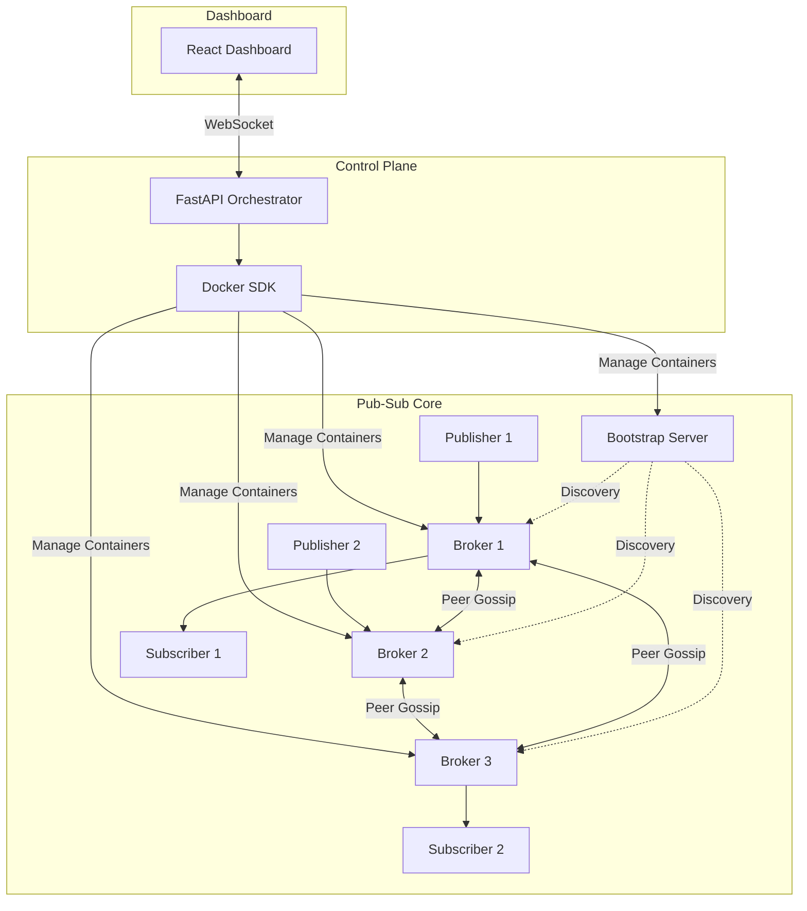

# Pub-Sub System: From Class Project to Portfolio Showpiece

## Complete Roadmap & Implementation Plan

---

## Current State

You have a working distributed pub-sub messaging system with:

- **Publishers** that send messages to topics
- **Brokers** (multiple instances) that route messages between publishers and subscribers
- **Subscribers** that receive messages from topics they're subscribed to
- **Bootstrap Server** acting as a centralized lookup/discovery service
- **Socket-based communication** (TCP) between all components
- **Chandy-Lamport snapshot algorithm** implemented across brokers for consistent global state capture
- **Acknowledgment-based reliable delivery**
- **Peer discovery** via the bootstrap server

Everything runs locally, likely started manually from separate terminals. No containerization, no orchestration, no visualization, no metrics.

---

## Target State

A fully containerized, orchestratable distributed pub-sub system with:

- Docker containers for every component
- A FastAPI control plane that can spin up/down brokers, publishers, and subscribers on demand
- A React frontend dashboard with sliders, live topology visualization, real-time message flow animation, and Chandy-Lamport snapshot visualization
- Benchmarking data with real throughput/latency numbers
- A polished GitHub repo with architecture docs, diagrams, and a one-command demo
- Resume bullets that make distributed systems engineers stop and read twice

---

## Phase 0: Foundation & Cleanup (Days 1–3)

**Goal:** Get the existing codebase into a clean, testable, documented state before building anything new.

### 0.1 — Code Audit & Refactor ✅

**Status: Completed**
All components (`pubsub-broker`, `pubsub-bootstrap`, `pubsub-publishers`, `pubsub-subscribers`, `pubsub-admin`, `pubsub-distributed`) are independently launchable via CLI entry points registered in `pyproject.toml`. Each accepts `--host`, `--port`, `--config`, `--log-level`, and `--log-file` args. This is the prerequisite for Docker containerization in Phase 1.

Go through your existing code and make sure every component has a clean, well-defined interface. Each component (broker, publisher, subscriber, bootstrap server) should be runnable as a standalone script with command-line arguments.

```
# Target: each component launchable like this
python broker.py --id broker-1 --host 0.0.0.0 --port 5001 --bootstrap localhost:4000
python publisher.py --id pub-1 --host 0.0.0.0 --port 6001 --bootstrap localhost:4000
python subscriber.py --id sub-1 --host 0.0.0.0 --port 7001 --bootstrap localhost:4000 --topics weather,sports
python bootstrap_server.py --host 0.0.0.0 --port 4000
```

If your components don't already accept CLI args, add them using `argparse`. This is a prerequisite for containerization — Docker containers need to be configurable via environment variables or arguments.

### 0.2 — Add Logging ✅

**Status: Completed**
Replaced all `print()` statements with Python's `logging` module. Uses a `QueueListener` for non-blocking logging, `ContextVar` for propagating correlation IDs (`msg_id`), and provides structured `JSONFormatter` output or a `ColoredFormatter` depending on the terminal environment. This perfectly sets up the data source for the real-time dashboard later.

### 0.3 — Add a Health/Status Endpoint ✅

**Status: Completed**
`StatusServer` (stdlib `ThreadingHTTPServer`, zero new dependencies) runs as a daemon thread alongside the broker. `GET /status` returns live JSON: peers, subscriber count, messages processed, uptime, and snapshot state. Wired into `GossipBroker` via `http_port` param (default: `broker_port + 10000`) and exposed via `--status-port` CLI arg. `BootstrapStatusServer` provides the same endpoint for the bootstrap server (default: `bootstrap_port + 10000`), enabling Docker healthchecks in Phase 1. Both covered by 8 unit tests in `tests/unit/test_status.py`.

Add a simple HTTP endpoint to each broker (use a lightweight thread running an HTTP server alongside the socket server). This endpoint returns the broker's current state as JSON:

```python
# GET /status on each broker returns:
{
    "broker_id": "broker-1",
    "host": "0.0.0.0",
    "port": 5001,
    "peers": ["broker-2", "broker-3"],
    "topics": ["weather", "sports", "finance"],
    "subscribers": {"weather": 3, "sports": 1},
    "messages_processed": 1847,
    "uptime_seconds": 342,
    "snapshot_state": "idle"  # or "recording" or "complete"
}
```

This status endpoint is what the orchestration layer and dashboard will poll. Use Python's built-in `http.server` or `threading` with a simple Flask/FastAPI instance — keep it lightweight.

### 0.4 — Write a Basic Test Script ✅

**Status: Completed**
`tests/integration/test_e2e.py` is a subprocess-based integration test that launches real OS processes via CLI entry points (`pubsub-bootstrap`, `pubsub-broker`, `pubsub-publishers`, `pubsub-subscribers`). It starts 1 bootstrap server, 3 brokers in a full mesh, 1 subscriber process, and 1 publisher process; writes a temp `config.yaml` with dynamically allocated ports; polls `/status` HTTP endpoints to verify peer discovery, mesh formation, subscriber registration, message flow, and Chandy-Lamport snapshot completion. All 8 checks pass. Run with `python tests/integration/test_e2e.py`.

Create a script that programmatically starts the full system, publishes N messages, verifies they're received by subscribers, triggers a snapshot, and validates the snapshot output. This becomes your regression test as you add features.

```python
# test_system.py
# 1. Start bootstrap server
# 2. Start 3 brokers
# 3. Start 2 publishers, 2 subscribers
# 4. Publish 100 messages across 3 topics
# 5. Wait for delivery, verify subscriber received correct messages
# 6. Trigger Chandy-Lamport snapshot
# 7. Validate snapshot output (local states + channel states)
# 8. Print results: messages sent, received, lost, snapshot consistency check
```

**Deliverable:** Clean codebase where every component is independently launchable with CLI args, structured JSON logging, a /status HTTP endpoint on each broker, and a basic integration test.

---

## Phase 1: Containerization (Days 4–7)

**Goal:** Every component runs in its own Docker container. The entire system spins up with one command.

### 1.1 — Dockerfiles

Create a single Dockerfile that works for all components (they're all Python):

```dockerfile
FROM python:3.11-slim

WORKDIR /app
COPY requirements.txt .
RUN pip install --no-cache-dir -r requirements.txt

COPY . .

# Component determined by CMD override in docker-compose
CMD ["python", "broker.py"]
```

### 1.2 — Docker Compose (Static Topology)

Start with a fixed topology to prove containerization works:

```yaml
# docker-compose.yml
version: "3.8"

services:
  bootstrap:
    build: .
    command: python bootstrap_server.py --host 0.0.0.0 --port 4000
    ports:
      - "4000:4000"
    networks:
      - pubsub-net
    healthcheck:
      test: ["CMD", "curl", "-f", "http://localhost:4000/status"]
      interval: 5s
      retries: 3

  broker-1:
    build: .
    command: python broker.py --id broker-1 --host 0.0.0.0 --port 5001 --bootstrap bootstrap:4000
    ports:
      - "5001:5001"
      - "8001:8001" # HTTP status endpoint
    depends_on:
      bootstrap:
        condition: service_healthy
    networks:
      - pubsub-net

  broker-2:
    build: .
    command: python broker.py --id broker-2 --host 0.0.0.0 --port 5002 --bootstrap bootstrap:4000
    ports:
      - "5002:5002"
      - "8002:8002"
    depends_on:
      bootstrap:
        condition: service_healthy
    networks:
      - pubsub-net

  broker-3:
    build: .
    command: python broker.py --id broker-3 --host 0.0.0.0 --port 5003 --bootstrap bootstrap:4000
    ports:
      - "5003:5003"
      - "8003:8003"
    depends_on:
      bootstrap:
        condition: service_healthy
    networks:
      - pubsub-net

  publisher-1:
    build: .
    command: python publisher.py --id pub-1 --bootstrap bootstrap:4000 --topics weather,sports --rate 10
    depends_on:
      - broker-1
      - broker-2
      - broker-3
    networks:
      - pubsub-net

  subscriber-1:
    build: .
    command: python subscriber.py --id sub-1 --bootstrap bootstrap:4000 --topics weather
    depends_on:
      - broker-1
    networks:
      - pubsub-net

networks:
  pubsub-net:
    driver: bridge
```

### 1.3 — Verify Everything Works

```bash
docker-compose up --build
# Watch logs: brokers should discover each other, publishers should start sending,
# subscribers should start receiving.
```

Fix any networking issues. The most common problem: your code might be using `localhost` to connect to peers, but in Docker, each container has its own network namespace. Brokers need to connect using container names (e.g., `broker-2:5002`) or IPs on the Docker bridge network. Your bootstrap server's registry needs to store addresses that are resolvable across containers.

### 1.4 — Add a Demo Make Target

```makefile
# Makefile
.PHONY: demo clean

demo:
	docker-compose up --build -d
	@echo "Waiting for system to stabilize..."
	sleep 10
	@echo "System running. Publishing messages..."
	docker exec pubsub-publisher-1 python trigger_demo.py
	@echo "Triggering Chandy-Lamport snapshot..."
	docker exec pubsub-broker-1 python trigger_snapshot.py
	@echo "Snapshot results:"
	docker exec pubsub-broker-1 cat /tmp/snapshot_output.json | python -m json.tool

clean:
	docker-compose down -v
```

**Deliverable:** `docker-compose up` spins up the entire distributed system. `make demo` runs a full demo with message publishing and a snapshot. Everything works across containers on a Docker network.

---

## Phase 2: Orchestration API — The Control Plane (Days 8–14)

**Goal:** A FastAPI service that can dynamically create and destroy pub-sub components by managing Docker containers programmatically.

### 2.1 — Project Structure

```
pubsub-system/
├── core/                    # Your existing pub-sub code
│   ├── broker.py
│   ├── publisher.py
│   ├── subscriber.py
│   ├── bootstrap_server.py
│   └── snapshot.py
├── orchestrator/            # New: Control plane
│   ├── main.py              # FastAPI app
│   ├── docker_manager.py    # Docker SDK wrapper
│   ├── state.py             # System state tracking
│   └── events.py            # WebSocket event broadcasting
├── dashboard/               # New: Frontend (Phase 3)
├── docker-compose.yml
├── Dockerfile
├── Makefile
└── README.md
```

### 2.2 — Docker Manager

This is the core of the orchestration layer. It uses the Docker SDK for Python to manage containers:

```python
# orchestrator/docker_manager.py
import docker
import uuid

class DockerManager:
    def __init__(self):
        # Mount the Docker socket so the orchestrator can control Docker
        self.client = docker.from_env()
        self.network_name = "pubsub-net"
        self.containers = {}  # id -> container info
        self._ensure_network()

    def _ensure_network(self):
        """Create the Docker network if it doesn't exist."""
        try:
            self.client.networks.get(self.network_name)
        except docker.errors.NotFound:
            self.client.networks.create(self.network_name, driver="bridge")

    def create_broker(self, broker_id: str = None) -> dict:
        """Spin up a new broker container."""
        broker_id = broker_id or f"broker-{uuid.uuid4().hex[:6]}"
        port = self._next_available_port("broker")

        container = self.client.containers.run(
            image="pubsub-core",
            command=f"python broker.py --id {broker_id} --host 0.0.0.0 --port {port} --bootstrap bootstrap:4000",
            name=broker_id,
            network=self.network_name,
            detach=True,
            ports={f"{port}/tcp": port, f"{port + 3000}/tcp": port + 3000},
            labels={"pubsub.role": "broker", "pubsub.id": broker_id}
        )

        self.containers[broker_id] = {
            "id": broker_id,
            "type": "broker",
            "container_id": container.id,
            "port": port,
            "status_port": port + 3000,
            "status": "running"
        }
        return self.containers[broker_id]

    def remove_broker(self, broker_id: str) -> dict:
        """Gracefully stop and remove a broker container."""
        if broker_id not in self.containers:
            raise ValueError(f"Unknown broker: {broker_id}")

        container = self.client.containers.get(self.containers[broker_id]["container_id"])
        container.stop(timeout=10)
        container.remove()
        info = self.containers.pop(broker_id)
        info["status"] = "removed"
        return info

    def create_publisher(self, publisher_id: str = None, topics: list = None, rate: int = 10) -> dict:
        """Spin up a new publisher container."""
        # Similar to create_broker, but runs publisher.py
        ...

    def create_subscriber(self, subscriber_id: str = None, topics: list = None) -> dict:
        """Spin up a new subscriber container."""
        ...

    def get_system_state(self) -> dict:
        """Return current state of all running components."""
        state = {"brokers": [], "publishers": [], "subscribers": []}
        for cid, info in self.containers.items():
            state[f"{info['type']}s"].append(info)
        return state

    def trigger_snapshot(self, initiator_broker_id: str) -> dict:
        """Trigger Chandy-Lamport snapshot on a specific broker."""
        # Send HTTP request to the broker's status endpoint
        # or exec into the container to trigger snapshot
        ...

    def _next_available_port(self, component_type: str) -> int:
        """Find next available port for a component type."""
        ...
```

### 2.3 — FastAPI Endpoints

```python
# orchestrator/main.py
from fastapi import FastAPI, WebSocket, WebSocketDisconnect
from fastapi.middleware.cors import CORSMiddleware
from docker_manager import DockerManager
from events import EventBroadcaster

app = FastAPI(title="Pub-Sub Control Plane")
app.add_middleware(CORSMiddleware, allow_origins=["*"], allow_methods=["*"], allow_headers=["*"])

docker_mgr = DockerManager()
broadcaster = EventBroadcaster()

# --- Component Lifecycle ---

@app.post("/api/brokers")
async def add_broker():
    """Spin up a new broker."""
    broker = docker_mgr.create_broker()
    await broadcaster.emit("broker_added", broker)
    return broker

@app.delete("/api/brokers/{broker_id}")
async def remove_broker(broker_id: str):
    """Remove a broker."""
    result = docker_mgr.remove_broker(broker_id)
    await broadcaster.emit("broker_removed", result)
    return result

@app.post("/api/publishers")
async def add_publisher(topics: list[str] = ["default"], rate: int = 10):
    """Spin up a new publisher."""
    publisher = docker_mgr.create_publisher(topics=topics, rate=rate)
    await broadcaster.emit("publisher_added", publisher)
    return publisher

@app.delete("/api/publishers/{publisher_id}")
async def remove_publisher(publisher_id: str):
    result = docker_mgr.remove_publisher(publisher_id)
    await broadcaster.emit("publisher_removed", result)
    return result

@app.post("/api/subscribers")
async def add_subscriber(topics: list[str] = ["default"]):
    subscriber = docker_mgr.create_subscriber(topics=topics)
    await broadcaster.emit("subscriber_added", subscriber)
    return subscriber

@app.delete("/api/subscribers/{subscriber_id}")
async def remove_subscriber(subscriber_id: str):
    result = docker_mgr.remove_subscriber(subscriber_id)
    await broadcaster.emit("subscriber_removed", result)
    return result

# --- System State ---

@app.get("/api/state")
async def get_state():
    """Return full system topology and status."""
    return docker_mgr.get_system_state()

@app.get("/api/state/topology")
async def get_topology():
    """Return node connections for graph visualization."""
    # Query each broker's /status endpoint for peer lists
    # Return nodes and edges
    ...

# --- Snapshots ---

@app.post("/api/snapshots")
async def trigger_snapshot(initiator: str = None):
    """Trigger Chandy-Lamport snapshot."""
    result = docker_mgr.trigger_snapshot(initiator)
    await broadcaster.emit("snapshot_initiated", result)
    return result

@app.get("/api/snapshots/latest")
async def get_latest_snapshot():
    """Return the most recent snapshot result."""
    ...

# --- Metrics ---

@app.get("/api/metrics")
async def get_metrics():
    """Aggregate metrics from all brokers."""
    # Poll each broker's /status endpoint
    # Return aggregate: total messages, throughput, latency
    ...

# --- Real-Time Events (WebSocket) ---

@app.websocket("/ws/events")
async def websocket_events(websocket: WebSocket):
    """Stream real-time system events to the dashboard."""
    await websocket.accept()
    broadcaster.register(websocket)
    try:
        while True:
            # Keep connection alive, also accept commands from frontend
            data = await websocket.receive_text()
            # Handle frontend commands if needed
    except WebSocketDisconnect:
        broadcaster.unregister(websocket)
```

### 2.4 — Event Broadcasting

The orchestrator needs to push real-time events to the frontend. There are two types of events:

**Orchestration events** (from the control plane itself): broker_added, broker_removed, publisher_added, snapshot_initiated, etc.

**System events** (from the pub-sub components): message_published, message_delivered, snapshot_marker_sent, snapshot_marker_received, snapshot_complete, etc.

For system events, you have two options:

**Option A — Log aggregation:** Each container writes JSON logs. The orchestrator tails these logs via Docker SDK (`container.logs(stream=True)`) and forwards relevant events to the WebSocket.

**Option B — Direct reporting:** Each pub-sub component reports events to the orchestrator via HTTP POST to a `/api/events/ingest` endpoint. This is cleaner but requires modifying your core pub-sub code.

Recommendation: Start with Option A (log tailing). It's non-invasive — you don't have to modify your core pub-sub code, just make sure it logs in JSON format (which you set up in Phase 0).

```python
# orchestrator/events.py
import asyncio
import json

class EventBroadcaster:
    def __init__(self):
        self.connections = set()

    def register(self, ws):
        self.connections.add(ws)

    def unregister(self, ws):
        self.connections.discard(ws)

    async def emit(self, event_type: str, data: dict):
        message = json.dumps({"type": event_type, "data": data, "timestamp": time.time()})
        dead = set()
        for ws in self.connections:
            try:
                await ws.send_text(message)
            except:
                dead.add(ws)
        self.connections -= dead
```

### 2.5 — Orchestrator Docker Setup

The orchestrator itself runs as a container, but it needs access to the Docker socket to manage other containers:

```yaml
# Add to docker-compose.yml
orchestrator:
  build:
    context: .
    dockerfile: Dockerfile.orchestrator
  command: uvicorn orchestrator.main:app --host 0.0.0.0 --port 9000
  ports:
    - "9000:9000"
  volumes:
    - /var/run/docker.sock:/var/run/docker.sock # Docker-in-Docker access
  depends_on:
    bootstrap:
      condition: service_healthy
  networks:
    - pubsub-net
```

**Deliverable:** A running FastAPI service at `localhost:9000` with full CRUD for brokers, publishers, and subscribers. `POST /api/brokers` actually spins up a new Docker container. WebSocket at `/ws/events` streams real-time system events. Full Swagger docs at `/docs`.

---

## Phase 3: Frontend Dashboard (Days 15–25)

**Goal:** A React-based dashboard that visualizes the live system and provides interactive controls.

### 3.1 — Tech Stack

- **React** with hooks (you're familiar with React from your other projects)
- **D3.js** for the topology graph and message flow animation
- **Tailwind CSS** for styling
- **WebSocket** for real-time updates from the orchestrator

### 3.2 — Dashboard Layout

```
┌─────────────────────────────────────────────────────────┐
│  PubSub Control Plane                    [Trigger Snap] │
├───────────┬─────────────────────────────────────────────┤
│ CONTROLS  │                                             │
│           │         TOPOLOGY GRAPH                      │
│Brokers    │                                             │
│ [===3===] │    [B1] ←——→ [B2]                           │
│           │      ↕    ╲   ↕                             │
│Publishers │    [P1]    [B3]                             │
│ [===2===] │             ↕                               │
│           │           [S1] [S2]                         │
│Subscribers│                                             │
│ [===2===] │                                             │
│           │                                             │
│ Topics    ├─────────────────────────────────────────────┤
│ [weather] │  METRICS                    EVENT LOG       │
│ [sports ] │  Throughput: 2,341 msg/s    14:03:22 B1→B2  │
│ [finance] │  Latency p50: 2ms           14:03:22 B2→S1  │
│           │  Latency p99: 12ms          14:03:21 P1→B1  │
│           │  Active snaps: 0            14:03:21 MARKER │
└───────────┴─────────────────────────────────────────────┘
```

### 3.3 — Key Components

**Slider Controls (left panel):**
Each slider calls the orchestration API. Moving the broker slider from 3 to 5 triggers two `POST /api/brokers` calls. Moving it from 5 to 3 triggers two `DELETE /api/brokers/{id}` calls (removing the most recently added brokers). Add topic selector checkboxes that configure what publishers send and what subscribers listen to.

**Topology Graph (center, the star of the show):**
Use D3.js force-directed graph. Nodes are brokers (large circles), publishers (small squares), and subscribers (small triangles). Edges represent active connections. Color-code by type. When a new broker spins up, animate it appearing and edges forming. When a broker is removed, animate it fading and edges disappearing.

**Message Flow Animation:**
When a message travels from publisher → broker → subscriber, animate a small dot moving along the edge. Use the WebSocket event stream — each "message_forwarded" event triggers an animation. During a Chandy-Lamport snapshot, render the MARKER messages as a different color (red) so you can visually see them propagating through the graph. This is the moment that makes people go "oh wow."

**Metrics Panel (bottom-left):**
Poll `GET /api/metrics` every second. Display throughput (messages/second), latency (p50, p99), active brokers/publishers/subscribers counts, and snapshot status.

**Event Log (bottom-right):**
Scrolling log of WebSocket events. Timestamp, source, destination, event type. Color-coded by event type (message = blue, snapshot marker = red, broker join/leave = yellow).

### 3.4 — Snapshot Visualization (This Is Your Differentiator)

When the user clicks "Trigger Snapshot":

1. The initiating broker flashes/highlights
2. MARKER messages (red dots) animate outward from that broker to all peers
3. As each broker receives its first MARKER, it highlights (indicating local state captured)
4. Channel recording is shown with a colored border on edges being recorded
5. When a broker receives MARKERs from all channels, the recording stops (border returns to normal)
6. When all brokers have completed, a modal/panel shows the global snapshot: each broker's local state and each channel's recorded messages

This single visualization demonstrates that you understand the algorithm deeply enough to make it visible. That's a level of mastery most people can't demonstrate.

### 3.5 — Docker Setup for Frontend

```yaml
dashboard:
  build:
    context: ./dashboard
    dockerfile: Dockerfile
  ports:
    - "3000:3000"
  environment:
    - REACT_APP_API_URL=http://localhost:9000
    - REACT_APP_WS_URL=ws://localhost:9000/ws/events
  depends_on:
    - orchestrator
  networks:
    - pubsub-net
```

**Deliverable:** A live, interactive dashboard at `localhost:3000`. Sliders dynamically add/remove containers. The topology graph updates in real time. Message flow is visually animated. Chandy-Lamport snapshots visually propagate through the system.

---

## Phase 4: Benchmarking & Metrics (Days 26–30)

**Goal:** Generate real performance numbers you can put on your resume.

### 4.1 — Benchmark Script

```python
# benchmarks/throughput_test.py
"""
Measures:
- Messages per second (throughput) at varying broker/publisher counts
- End-to-end latency (publisher send → subscriber receive) at p50, p95, p99
- Snapshot completion time (initiation → all brokers finished)
- Message loss rate under load
"""

import time
import statistics

class BenchmarkRunner:
    def __init__(self, orchestrator_url="http://localhost:9000"):
        self.api = orchestrator_url

    def throughput_test(self, num_brokers=3, num_publishers=5, num_subscribers=5,
                        duration_seconds=60, messages_per_second=1000):
        """
        Ramp up system, publish at target rate, measure actual throughput.
        """
        # 1. Set up topology via orchestrator API
        # 2. Start publishers at target rate
        # 3. Measure subscriber receive rate over duration
        # 4. Calculate throughput, loss rate
        ...

    def latency_test(self, num_brokers=3, num_messages=10000):
        """
        Embed timestamps in messages, measure delivery latency.
        """
        # Publisher embeds send_timestamp in message payload
        # Subscriber records receive_timestamp
        # Calculate deltas, compute percentiles
        ...

    def snapshot_benchmark(self, num_brokers_range=[3, 5, 10, 20]):
        """
        Measure snapshot completion time as broker count scales.
        """
        # For each broker count:
        #   1. Set up topology
        #   2. Start message flow
        #   3. Trigger snapshot, measure time to completion
        ...

    def scaling_test(self):
        """
        Gradually increase publishers and measure throughput ceiling.
        """
        # Start with 1 publisher, increase to 50
        # Plot throughput vs publisher count
        # Find saturation point
        ...
```

### 4.2 — Timestamp Embedding for Latency

Modify your publisher to embed `send_timestamp` in the message payload. Modify your subscriber to compute `receive_timestamp - send_timestamp`. This gives you end-to-end latency. Important: use `time.monotonic_ns()` for same-machine tests, or embed UTC timestamps if testing across actual machines.

### 4.3 — Target Numbers to Aim For

These are rough targets that would look good on a resume. Actual results depend on your hardware and implementation:

| Metric                    | Target        | Resume-Worthy                            |
| ------------------------- | ------------- | ---------------------------------------- |
| Throughput (3 brokers)    | 5,000+ msg/s  | "Sustained 5K+ messages/second"          |
| Throughput (10 brokers)   | 10,000+ msg/s | "Scaled to 10K+ msg/s across 10 brokers" |
| Latency p50               | < 5ms         | "Sub-5ms median delivery latency"        |
| Latency p99               | < 50ms        | "< 50ms p99 latency"                     |
| Snapshot time (3 brokers) | < 100ms       | "Consistent snapshots in < 100ms"        |
| Message loss              | 0%            | "Zero-loss guaranteed delivery"          |

Even if your numbers are lower, having real numbers at all puts you ahead of 95% of applicants.

### 4.4 — Generate Charts

Use matplotlib to generate performance charts. Include them in your README:

- Throughput vs. number of brokers (line chart)
- Latency distribution (histogram with p50/p99 lines)
- Snapshot completion time vs. broker count (line chart)
- Throughput over time during a scaling test (line chart showing ramp-up)

**Deliverable:** A `benchmarks/` directory with runnable benchmark scripts and generated charts. Real, measurable performance numbers ready for your resume and README.

---

## Phase 5: Hardening & Extra Features (Days 31–40)

**Goal:** Add features that push this from "impressive class project" to "this could be production infrastructure."

### 5.1 — Fault Tolerance (High Priority)

**Heartbeat-based failure detection:**

Each broker sends periodic heartbeats to its peers (every 2 seconds). If a broker doesn't receive a heartbeat from a peer for 3 consecutive intervals (6 seconds), it marks that peer as dead and notifies the bootstrap server.

**Topic reassignment on broker failure:**

When a broker dies, its topics need to be redistributed to surviving brokers. The bootstrap server (or a leader broker) handles reassignment. Subscribers that were connected to the dead broker get redirected to the new owner of their topics.

This is essentially a simplified version of Kafka's partition reassignment. Implement it and you can say: "Implemented failure detection with heartbeats and automatic topic reassignment, achieving subscriber continuity during broker failures."

### 5.2 — Write-Ahead Log (Medium Priority)

Add a simple append-only log per topic on each broker. Before acknowledging a message, write it to disk. On broker restart, replay the log to recover state.

```python
class WriteAheadLog:
    def __init__(self, topic: str, log_dir: str = "/data/wal"):
        self.filepath = f"{log_dir}/{topic}.log"
        self.file = open(self.filepath, "a")

    def append(self, message: dict):
        line = json.dumps(message) + "\n"
        self.file.write(line)
        self.file.flush()
        os.fsync(self.file.fileno())  # Ensure it hits disk

    def replay(self) -> list:
        messages = []
        with open(self.filepath, "r") as f:
            for line in f:
                messages.append(json.loads(line.strip()))
        return messages
```

This gives you durability. If a broker crashes and restarts, it replays the WAL and recovers. That's how Kafka, PostgreSQL, and every serious database works.

### 5.3 — Message Ordering Guarantees (Medium Priority)

Add per-topic sequence numbers. Publishers embed a monotonically increasing sequence number. Brokers track the latest sequence per topic. Subscribers can detect gaps and request retransmission. This lets you guarantee exactly-once or at-least-once delivery with ordering.

### 5.4 — Graceful Broker Drain (Lower Priority)

When a broker is being removed (slider goes down), instead of hard-killing it, implement a drain protocol: stop accepting new subscriptions, finish delivering in-flight messages, transfer topics to other brokers, then shut down. This is how real production systems handle rolling deployments.

**Deliverable:** Fault tolerance with heartbeats, automatic topic reassignment, write-ahead logging for durability, and optional message ordering guarantees.

---

## Phase 6: Documentation & Presentation (Days 41–45)

**Goal:** Make the GitHub repository itself a portfolio piece.

### 6.1 — README Structure

```markdown
# Distributed Pub-Sub Messaging System

A distributed publish-subscribe messaging system with multi-broker architecture,
Chandy-Lamport distributed snapshots, and a real-time orchestration dashboard.

[Screenshot/GIF of dashboard with messages flowing and snapshot happening]

## Architecture

[Mermaid diagram showing: Publishers → Brokers (mesh) → Subscribers,
Bootstrap Server in the center, Orchestrator + Dashboard on the side]

## Key Features

- Multi-broker architecture with dynamic scaling
- Chandy-Lamport distributed snapshot algorithm
- Acknowledgment-based reliable message delivery
- Write-ahead logging for durability
- Heartbeat-based failure detection with automatic topic reassignment
- Real-time orchestration dashboard with live topology visualization
- Docker-based deployment with programmatic container orchestration

## Quick Start

    docker-compose up
    # Dashboard: http://localhost:3000
    # API Docs: http://localhost:9000/docs

## Performance

[Embed throughput and latency charts here]

| Metric        | Value                   |
| ------------- | ----------------------- |
| Throughput    | X,XXX msg/s (3 brokers) |
| Latency (p99) | XXms                    |
| Snapshot time | XXms                    |

## Design Decisions

### Why Chandy-Lamport?

[Explain the consistency problem, why you can't just pause everything,
how FIFO channels + markers solve it. Draw the analogy to Apache Flink's
distributed checkpointing.]

### Why a centralized bootstrap server instead of gossip?

[Explain the tradeoff: simpler implementation, single point of failure,
but sufficient for the scale you're targeting. Note that gossip would be
the right choice at larger scale.]

### Why write-ahead logging?

[Explain durability guarantees, compare to how Kafka's log works.]

## How It Works

[Detailed explanation of message flow, snapshot algorithm, failure recovery]

## Analogies to Production Systems

| This Project             | Production Equivalent           |
| ------------------------ | ------------------------------- |
| Bootstrap Server         | ZooKeeper / etcd                |
| Broker mesh              | Kafka broker cluster            |
| Chandy-Lamport snapshots | Flink distributed checkpointing |
| Write-ahead log          | Kafka commit log                |
| Topic reassignment       | Kafka partition rebalancing     |
| Orchestrator API         | Kubernetes control plane        |
```

### 6.2 — Record a Demo Video/GIF

Use a screen recording tool to capture:

1. Dashboard loads with empty system
2. Slide broker count to 3 — watch containers appear in the topology
3. Add publishers and subscribers — messages start flowing visually
4. Click "Trigger Snapshot" — watch markers propagate through the system
5. Remove a broker — watch topic reassignment happen
6. Add it back — system rebalances

Convert to a GIF for the README. This 30-second GIF will sell the project more than any bullet point.

### 6.3 — Architecture Diagram

Create a clean Mermaid diagram for the README:



**Deliverable:** A polished GitHub repository with a README that serves as both documentation and a portfolio piece. Architecture diagrams, performance charts, demo GIF, and design decision explanations.

---

## Resume Bullets (Final Form)

After completing all phases, here's how the pub-sub project should read on your resume:

**Project Title:** Distributed Pub-Sub Messaging System | Python, FastAPI, Docker, React, D3.js, WebSocket

**Bullet 1 — Core System (distributed systems fundamentals):**
Designed multi-broker pub-sub messaging system with TCP socket communication, topic-based routing, and centralized service discovery, sustaining X,XXX messages/second across dynamically scaled broker clusters.

**Bullet 2 — Chandy-Lamport (the technical crown jewel):**
Implemented Chandy-Lamport distributed snapshot algorithm for consistent global state capture across broker processes, with real-time visualization of marker propagation over FIFO-ordered channels.

**Bullet 3 — Reliability & Fault Tolerance:**
Built fault-tolerant message delivery with write-ahead logging, acknowledgment protocols, and heartbeat-based failure detection with automatic topic reassignment, achieving zero message loss under broker failures.

**Bullet 4 — Orchestration & Observability:**
Developed Docker-based orchestration control plane with FastAPI, enabling dynamic container lifecycle management and real-time topology visualization via WebSocket-driven React dashboard.

Pick 2-3 of these depending on the role. For infrastructure roles, lead with bullets 1 and 2. For backend roles, lead with 1 and 3. For full-stack roles, lead with 1 and 4.

---

## Timeline Summary

| Phase                     | Days  | What You Build                                               | Key Signal                 |
| ------------------------- | ----- | ------------------------------------------------------------ | -------------------------- |
| **0: Foundation**         | 1–3   | Clean CLI args, JSON logging, /status endpoints, test script | Code quality               |
| **1: Containerization**   | 4–7   | Dockerfiles, docker-compose, one-command startup             | DevOps / containers        |
| **2: Orchestration API**  | 8–14  | FastAPI control plane, Docker SDK, WebSocket events          | Backend engineering        |
| **3: Frontend Dashboard** | 15–25 | React + D3.js live topology, message flow, snapshot viz      | Full-stack / observability |
| **4: Benchmarking**       | 26–30 | Throughput/latency tests, performance charts                 | Quantitative engineering   |
| **5: Hardening**          | 31–40 | Heartbeats, WAL, fault tolerance, message ordering           | Production thinking        |
| **6: Documentation**      | 41–45 | README, architecture docs, demo GIF, design decisions        | Communication              |

**Total estimated time: 6–7 weeks** working part-time alongside coursework.

**If you only have 2–3 weeks,** prioritize Phases 0, 1, 2, and 6. The containerization + orchestration API + good documentation alone will transform how this project reads. The dashboard (Phase 3) is the flashiest piece, but the orchestration API is what actually proves backend engineering skill.

---

## What This Project Becomes

When you're done, you don't have a class project. You have a **distributed systems platform** that demonstrates:

- You can design and implement distributed algorithms (Chandy-Lamport)
- You can build reliable, fault-tolerant systems (acknowledgments, WAL, heartbeats)
- You can containerize and orchestrate distributed services (Docker, control plane API)
- You can build observability tooling (real-time dashboard, metrics, event streaming)
- You can benchmark and quantify system performance (throughput, latency, scaling curves)
- You can communicate technical decisions clearly (README, architecture docs)

That's not a resume line. That's a conversation starter that could carry an entire 45-minute technical interview.
