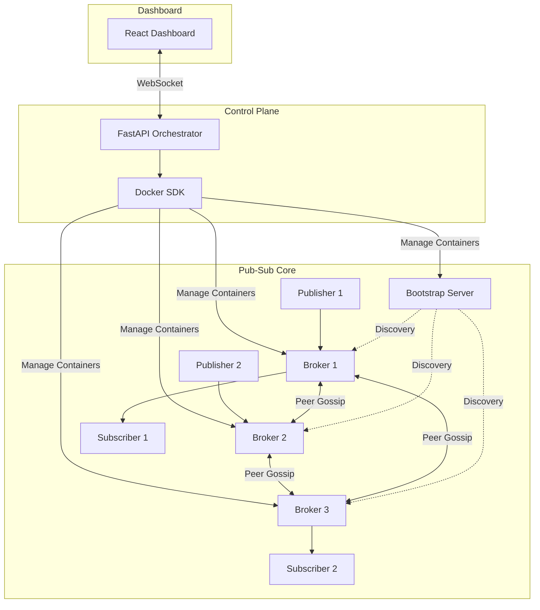

# Pub-Sub System: From Class Project to Portfolio Showpiece

## Complete Roadmap & Implementation Plan

---

## Current State

You have a working distributed pub-sub messaging system with:

- **Publishers** — each runs as its own process (`aether-publisher --publisher-id N`), owns its own TCP socket and HTTP `/status` endpoint
- **Brokers** (multiple instances) — each runs as its own process (`aether-broker --broker-id N`) with gossip protocol, heartbeats, and Chandy-Lamport snapshots
- **Subscribers** — each runs as its own process (`aether-subscriber --subscriber-id N`), owns its own TCP socket and HTTP `/status` endpoint
- **Bootstrap Server** — centralized peer discovery, its own `/status` endpoint
- **Socket-based communication** (TCP) between all components via `NetworkNode`
- **Chandy-Lamport snapshot algorithm** implemented across brokers for consistent global state capture
- **Acknowledgment-based reliable delivery**
- **Peer discovery** via the bootstrap server
- **One-process-per-component architecture** — ready for Docker containerization

Every component is independently launchable, independently observable via `GET /status`, and follows the same CLI pattern: one ID, one process, one container.

---

## Target State

A fully containerized, orchestratable distributed pub-sub system with:

- Docker containers for every component
- A FastAPI control plane that can spin up/down brokers, publishers, and subscribers on demand
- A React frontend dashboard with sliders, live topology visualization, real-time message flow animation, and Chandy-Lamport snapshot visualization
- Benchmarking data with real throughput/latency numbers
- A polished GitHub repo with architecture docs, diagrams, and a one-command demo
- Resume bullets that make distributed systems engineers stop and read twice

---

## Phase 0: Foundation & Cleanup (Days 1–3)

**Goal:** Get the existing codebase into a clean, testable, documented state before building anything new.

### 0.1 — Code Audit & Refactor ✅

**Status: Completed**

All components are independently launchable via CLI entry points registered in `pyproject.toml`. **Every component follows the same truly-distributed pattern** — one instance per CLI invocation, matching the Phase 1 containerization model:

| Command | Instance | Key Args |
|---|---|---|
| `aether-bootstrap` | One bootstrap server | `--host`, `--port`, `--status-port` |
| `aether-broker` | One broker | `--broker-id`, `--host`, `--port`, `--status-port` |
| `aether-subscriber` | One subscriber | `--subscriber-id`, `--host`, `--port`, `--status-port` |
| `aether-publisher` | One publisher | `--publisher-id`, `--host`, `--port`, `--status-port`, `--interval` |

All accept `--config`, `--log-level`, and `--log-file` args. Subscriber/publisher IDs are 0-indexed and determine the target broker, port, and payload range automatically.

```
# Each component launchable like this (one process = one container)
aether-broker --broker-id 1 --host broker-1 --port 8000 --status-port 18000
aether-subscriber --subscriber-id 0 --host sub-0
aether-publisher --publisher-id 0 --host pub-0 --interval 1.0
aether-bootstrap --host bootstrap --port 7000 --status-port 17000
```

This is the prerequisite for Docker containerization in Phase 1.

### 0.2 — Add Logging ✅

**Status: Completed**
Replaced all `print()` statements with Python's `logging` module. Uses a `QueueListener` for non-blocking logging, `ContextVar` for propagating correlation IDs (`msg_id`), and provides structured `JSONFormatter` output or a `ColoredFormatter` depending on the terminal environment. This perfectly sets up the data source for the real-time dashboard later.

### 0.3 — Add a Health/Status Endpoint ✅

**Status: Completed**

All four component types expose a `GET /status` HTTP endpoint via `ThreadingHTTPServer` (stdlib, zero new dependencies), each running as a daemon thread alongside the component's TCP socket:

| Component | Status Server Class | Default Port | Response Highlights |
|---|---|---|---|
| `GossipBroker` | `StatusServer` | `broker_port + 10000` | `peers`, `subscribers`, `messages_processed`, `snapshot_state`, `uptime_seconds` |
| `BootstrapServer` | `BootstrapStatusServer` | `bootstrap_port + 10000` | `registered_brokers`, `broker_count`, `uptime_seconds` |
| `NetworkSubscriber` | `SubscriberStatusServer` | `subscriber_port + 10000` | `broker`, `subscriptions`, `total_received`, `running`, `uptime_seconds` |
| `NetworkPublisher` | `PublisherStatusServer` | `publisher_port + 10000` | `brokers`, `broker_count`, `total_sent`, `uptime_seconds` |

All status servers share the same handler pattern: dynamic subclass with component reference injected via class attribute, `_send_json()` helper, 404 for unknown paths. The `--status-port` CLI arg allows overriding the default on all components.

Uptime tracking added to `NetworkSubscriber` and `NetworkPublisher` via `_start_time` attribute (set in `__init__`).

Covered by **15 unit tests** in `tests/unit/test_status.py`: 5 for broker, 3 for bootstrap, 4 for subscriber, 3 for publisher. Each test creates the component (no background threads except `NetworkNode`), starts the status server, hits `/status` via `urllib`, and asserts on the response shape and live state reflection.

### 0.4 — Write a Basic Test Script ✅

**Status: Completed**

`tests/integration/test_e2e.py` is a subprocess-based integration test that launches real OS processes via CLI entry points (`aether-bootstrap`, `aether-broker`, `aether-subscriber`, `aether-publisher`). It starts 1 bootstrap server, 3 brokers in a full mesh, individual subscriber processes, and individual publisher processes; writes a temp `config.yaml` with dynamically allocated ports; polls `/status` HTTP endpoints to verify peer discovery, mesh formation, subscriber registration, message flow, and Chandy-Lamport snapshot completion. All checks pass. Run with `python tests/integration/test_e2e.py`.

Create a script that programmatically starts the full system, publishes N messages, verifies they're received by subscribers, triggers a snapshot, and validates the snapshot output. This becomes your regression test as you add features.

```python
# test_system.py
# 1. Start bootstrap server
# 2. Start 3 brokers
# 3. Start 2 publishers, 2 subscribers
# 4. Publish 100 messages across 3 topics
# 5. Wait for delivery, verify subscriber received correct messages
# 6. Trigger Chandy-Lamport snapshot
# 7. Validate snapshot output (local states + channel states)
# 8. Print results: messages sent, received, lost, snapshot consistency check
```

**Deliverable:** Clean codebase where every component is independently launchable with CLI args, structured JSON logging, a /status HTTP endpoint on each broker, and a basic integration test.

---

## Phase 1: Containerization (Days 4–7)

**Goal:** Every component runs in its own Docker container. The entire system spins up with one command.

### 1.1 — Dockerfiles ✅

**Status: Completed**

Single Dockerfile works for all components (they're all Python). Uses `python:3.13-slim` base image with `pyyaml` dependency. Component is determined by CMD override in `docker-compose.yml`.

### 1.2 — Docker Compose (Truly Distributed Topology) ✅

**Status: Completed**

The `docker-compose.yml` implements the **truly distributed model** — each component runs in its own container:

| Service | Container Name | CLI Command |
|---|---|---|
| `bootstrap` | `aether-bootstrap` | `aether-bootstrap --host bootstrap --port 7000 --status-port 17000` |
| `broker-1` | `aether-broker-1` | `aether-broker --broker-id 1 --host broker-1 --port 8000 --status-port 18000` |
| `broker-2` | `aether-broker-2` | `aether-broker --broker-id 2 --host broker-2 --port 8000 --status-port 18000` |
| `broker-3` | `aether-broker-3` | `aether-broker --broker-id 3 --host broker-3 --port 8000 --status-port 18000` |
| `subscriber-0` | `aether-subscriber-0` | `aether-subscriber --subscriber-id 0 --host subscriber-0` |
| `subscriber-1` | `aether-subscriber-1` | `aether-subscriber --subscriber-id 1 --host subscriber-1` |
| `subscriber-2` | `aether-subscriber-2` | `aether-subscriber --subscriber-id 2 --host subscriber-2` |
| `publisher-0` | `aether-publisher-0` | `aether-publisher --publisher-id 0 --host publisher-0 --interval 1.0` |
| `publisher-1` | `aether-publisher-1` | `aether-publisher --publisher-id 1 --host publisher-1 --interval 1.0` |

Each container has:
- Unique hostname on the Docker bridge network (`aether-net`)
- Own TCP port and status port exposed to host
- Healthcheck polling `GET /status` (brokers and bootstrap)
- Dependencies on broker health before starting (subscribers and publishers)

### 1.3 — Verify Everything Works ✅

```bash
make demo     # Build, start, wait 20s, query all /status endpoints
make status   # Query /status from every component
make logs     # Tail all container logs
make clean    # Tear down everything
```

### 1.4 — Make Targets ✅

```makefile
# Current Makefile targets:
make demo     # Build images, start system, wait for stabilization, print status
make status   # Query /status from all 9 components (bootstrap + 3 brokers + 3 subscribers + 2 publishers)
make logs     # Tail logs from all containers
make clean    # Stop and remove all containers, networks, and volumes
make test     # Run integration test (no Docker)
```

**Deliverable:** `make demo` spins up the entire distributed system across 9 containers (1 bootstrap, 3 brokers, 3 subscribers, 2 publishers). Every component has its own `/status` endpoint. `make status` queries all 9 endpoints. Everything works across containers on a Docker bridge network.

---

## Phase 2: Orchestration API — The Control Plane (Days 8–14)

**Goal:** A FastAPI service that can dynamically create and destroy pub-sub components by managing Docker containers programmatically.

### 2.0 — Prerequisites (Before Building the Orchestrator)

These are changes to the existing pub-sub core that must land before the orchestrator can manage components dynamically. Without them, the orchestrator will fight the existing code.

#### 2.0.1 — Extract Hardcoded Heartbeat Timeout to Config ✅

**Status: Completed** (commit `e42a423`)

**Problem:** The heartbeat *interval* is configurable via `config.yaml` (`gossip.heartbeat_interval`), but the peer eviction *timeout* is hardcoded to `15.0` seconds in `_check_heartbeat_loop()` inside `gossip/broker.py`:

```python
# gossip/broker.py — _check_heartbeat_loop()
timeout_threshold = 15.0  # magic number, ignores config
```

Meanwhile, `config.yaml` already has `heartbeat_timeout: 15.0` — it's just never threaded through to the broker. The config field exists, the broker ignores it.

**Why this matters for Phase 2:** The orchestrator will start/stop brokers dynamically. When a broker is removed, its peers need to detect the failure and evict it. If someone tunes `heartbeat_interval` in config (say, to 1s for faster demos) but the timeout stays at 15s, eviction takes way too long. Conversely, if the interval is increased to 10s but the timeout is still 15s, healthy peers get falsely evicted. The interval and timeout must be configured together.

**Fix:** Thread the timeout through the `GossipBroker` constructor, the same way `fanout`, `ttl`, and `snapshot_interval` are already passed:

1. Add `heartbeat_timeout: float = 15.0` parameter to `GossipBroker.__init__()`
2. Store as `self.heartbeat_timeout`
3. In `_check_heartbeat_loop()`, replace `timeout_threshold = 15.0` with `self.heartbeat_timeout`
4. In `cli/run_broker.py`, pass `heartbeat_timeout=config.heartbeat_timeout` to the constructor

This is a 4-line change. The config field already exists — you're just wiring it up.

**Production context:** Every production system (Kafka, Consul, etcd) treats heartbeat interval and timeout as a pair of knobs that operators tune together. Hardcoding one while exposing the other is a classic source of "works on my machine, breaks in staging" bugs.

#### 2.0.2 — Allow Explicit Broker Address for Subscribers ✅

**Status: Completed**

**Problem:** Subscribers are statically assigned to brokers via arithmetic on the subscriber ID in `cli/run_subscribers.py`:

```python
# cli/run_subscribers.py
broker_idx = args.subscriber_id // config.subscribers_per_broker
broker_addr = config.brokers[broker_idx].to_address()
```

This means subscriber 0 always goes to broker 0, subscriber 1 always goes to broker 0 (if `subscribers_per_broker=2`), etc. The mapping is baked into the CLI and derived from the config file's static broker list.

**Why this matters for Phase 2:** The orchestrator needs to spin up a subscriber and tell it *which* broker to connect to — potentially a broker that was dynamically created and doesn't exist in the original `config.yaml`. The current CLI has no way to do this.

**Fix:** Add `--broker-host` and `--broker-port` CLI args to `run_subscribers.py`. When provided, they override the config-derived broker address:

```python
parser.add_argument("--broker-host", help="Override broker host (for dynamic orchestration)")
parser.add_argument("--broker-port", type=int, help="Override broker port (for dynamic orchestration)")

# Later in main():
if args.broker_host and args.broker_port:
    broker_addr = NodeAddress(args.broker_host, args.broker_port)
else:
    broker_idx = args.subscriber_id // config.subscribers_per_broker
    broker_addr = config.brokers[broker_idx].to_address()
```

This is backwards-compatible — existing `docker-compose.yml` commands don't pass these flags, so they keep working. But the orchestrator can now do:

```python
container = client.containers.run(
    image="aether-core",
    command=f"aether-subscriber --subscriber-id {sid} --host {hostname} "
            f"--broker-host {broker.host} --broker-port {broker.port}",
    ...
)
```

**Production context:** In Kafka, consumers discover brokers via a bootstrap server list, not via static assignment. In your system, the bootstrap server already exists for broker-to-broker discovery. Long-term, subscribers could use the same mechanism. But for Phase 2, explicit `--broker-host/--broker-port` flags are the pragmatic fix that unblocks the orchestrator without redesigning subscriber discovery.

#### 2.0.3 — CLI Args Bypass Config Validation ✅

**Status: Completed**

The CLI scripts for brokers, publishers, and subscribers previously required their IDs to exist in `config.docker.yaml`, even when `--host` and `--port` were provided via CLI. This blocked the orchestrator from creating components with IDs outside the static config.

**Fixes applied:**

1. **`cli/run_broker.py`**: When `--host` and `--port` are both provided, skip the config broker list lookup entirely. Previously, `broker ID N not found in config` would `sys.exit(1)`.

2. **`cli/run_publishers.py`**: When `--host` and `--port` are both provided, skip the `publisher_count` range validation. Added `--broker-host` (repeatable) and `--broker-port` CLI args so the orchestrator can specify target brokers directly, bypassing `config.broker_addresses`.

3. **`cli/run_subscribers.py`**: Added `--range-low` and `--range-high` CLI args so the orchestrator can assign payload ranges directly, bypassing `partition_payload_space(total_subscribers)` which depends on the config's subscriber count. Also added `--host`/`--port` bypass for config validation (consistent with broker and publisher fixes).

All changes are backwards-compatible — existing `docker-compose.yml` commands don't pass the new args and continue using the config-based paths.

### 2.1 — Project Structure ✅

The orchestrator lives inside the `aether` package alongside the existing pub-sub code:

```
aether/
├── aether/
│   ├── gossip/              # Existing: GossipBroker with gossip protocol, snapshots
│   ├── network/             # Existing: NetworkPublisher, NetworkSubscriber, NetworkNode
│   ├── cli/                 # Existing: CLI entry points (run_broker, run_publisher, etc.)
│   ├── config/              # Existing: Config loading and validation
│   └── orchestrator/        # New: Control plane
│       ├── __init__.py
│       ├── models.py         # Pydantic models for API + WebSocket events ✅
│       ├── docker_manager.py # Docker SDK wrapper (manages containers)
│       ├── main.py           # FastAPI application
│       └── events.py         # WebSocket event broadcaster
├── dashboard/                # Phase 3: React frontend
├── docker-compose.yml
├── Dockerfile
├── Makefile
└── README.md
```

### 2.2 — Data Models ✅

**Status: Completed** — `aether/orchestrator/models.py`

All API request/response types and internal state are defined as Pydantic models. This makes FastAPI auto-generate accurate Swagger docs and enforces type safety at the boundary between the orchestrator and the dashboard.

#### Enums

```python
class ComponentType(StrEnum):
    BOOTSTRAP = "bootstrap"
    BROKER = "broker"
    PUBLISHER = "publisher"
    SUBSCRIBER = "subscriber"

class ComponentStatus(StrEnum):
    STARTING = "starting"
    RUNNING = "running"
    STOPPING = "stopping"
    STOPPED = "stopped"
    ERROR = "error"

class EventType(StrEnum):
    # Orchestration events (from control plane)
    BROKER_ADDED = "broker_added"
    BROKER_REMOVED = "broker_removed"
    PUBLISHER_ADDED = "publisher_added"
    PUBLISHER_REMOVED = "publisher_removed"
    SUBSCRIBER_ADDED = "subscriber_added"
    SUBSCRIBER_REMOVED = "subscriber_removed"
    COMPONENT_STATUS_CHANGED = "component_status_changed"

    # System events (from log tailing)
    MESSAGE_PUBLISHED = "message_published"
    MESSAGE_DELIVERED = "message_delivered"
    SNAPSHOT_INITIATED = "snapshot_initiated"
    SNAPSHOT_COMPLETE = "snapshot_complete"
    PEER_JOINED = "peer_joined"
    PEER_EVICTED = "peer_evicted"
```

#### Component State Tracking

`ComponentInfo` is the central record the orchestrator maintains per managed container. It covers all four component types using optional fields for type-specific data:

```python
class ComponentInfo(BaseModel):
    component_type: ComponentType
    component_id: int
    container_name: str        # e.g. "aether-broker-4"
    container_id: str | None   # Docker hex ID, None before container.run() returns
    hostname: str              # Docker DNS name on aether-net, e.g. "broker-4"
    internal_port: int         # TCP port inside the container
    internal_status_port: int  # HTTP status port (internal_port + 10000)
    host_port: int | None      # mapped to host for external access
    host_status_port: int | None
    status: ComponentStatus = ComponentStatus.STARTING
    created_at: datetime = Field(default_factory=datetime.utcnow)

    # Publisher-specific
    broker_ids: list[int] = Field(default_factory=list)
    publish_interval: float = 1.0

    # Subscriber-specific
    broker_id: int | None = None   # single parent broker
    range_low: int | None = None   # payload range [0-255]
    range_high: int | None = None
```

#### API Request Models

```python
class CreateBrokerRequest(BaseModel):
    broker_id: int | None = None       # auto-assigned if omitted

class CreatePublisherRequest(BaseModel):
    publisher_id: int | None = None
    broker_ids: list[int] | None = None  # None = all running brokers
    interval: float = Field(default=1.0, gt=0)

class CreateSubscriberRequest(BaseModel):
    subscriber_id: int | None = None
    broker_id: int                     # required — subscriber connects to exactly one broker
    range_low: int = Field(ge=0, le=255)   # required — caller owns range assignment
    range_high: int = Field(ge=0, le=255)  # required — caller owns range assignment

class TriggerSnapshotRequest(BaseModel):
    initiator_broker_id: int | None = None  # None = pick first running broker
```

#### API Response Models

```python
class SystemState(BaseModel):
    brokers: list[ComponentInfo]
    publishers: list[ComponentInfo]
    subscribers: list[ComponentInfo]
    bootstrap: BootstrapInfo | None

class TopologyResponse(BaseModel):
    nodes: list[TopologyNode]   # id, type, status per component
    edges: list[TopologyEdge]   # source, target, edge_type ("peer"/"publish"/"subscribe")

class MetricsResponse(BaseModel):
    brokers: list[BrokerMetrics]    # per-broker: peer_count, messages_processed, etc.
    total_messages_processed: int
    total_brokers: int
    total_publishers: int
    total_subscribers: int

class SnapshotStatusResponse(BaseModel):
    snapshot_id: str | None
    initiator_broker_id: int | None
    timestamp: float | None
    broker_states: list[dict]
    status: str   # "none" | "in_progress" | "complete"
```

#### WebSocket Event

Every event pushed over `/ws/events` is a `WebSocketEvent`:

```python
class WebSocketEvent(BaseModel):
    event_type: EventType
    timestamp: float        # time.time()
    data: dict              # ComponentInfo.model_dump() or event-specific payload
```

### 2.3 — Docker Manager ✅

**Status: Completed** — `aether/orchestrator/docker_manager.py`

`aether/orchestrator/docker_manager.py` — the core of the orchestration layer. Uses the Docker SDK for Python to manage containers, with `ComponentInfo` as the internal state record.

**Port allocation strategy:**
- Brokers: internal port `8000 + broker_id * 10`, status port `18000 + broker_id * 10`
- Publishers: internal port `9000 + publisher_id * 10`, status port `19000 + publisher_id * 10`
- Subscribers: internal port `9100 + subscriber_id * 10`, status port `19100 + subscriber_id * 10`
- Host ports mirror internal ports for external access.

**ID auto-assignment:** If `broker_id` / `publisher_id` / `subscriber_id` is omitted from the request, the manager assigns the next unused integer starting at 1. The orchestrator is the sole authority for all pub-sub containers — there are no docker-compose-managed brokers/publishers/subscribers to collide with.

```python
# aether/orchestrator/docker_manager.py
import docker
from .models import (
    ComponentInfo, ComponentType, ComponentStatus,
    CreateBrokerRequest, CreatePublisherRequest, CreateSubscriberRequest,
    SystemState, TopologyResponse, TopologyNode, TopologyEdge,
    MetricsResponse, BrokerMetrics, SnapshotStatusResponse, BootstrapInfo,
)

BOOTSTRAP_HOST = "bootstrap"
BOOTSTRAP_PORT = 7000
IMAGE_NAME = "aether-core"
NETWORK_NAME = "aether-net"

class DockerManager:
    def __init__(self):
        self.client = docker.from_env()
        self._components: dict[str, ComponentInfo] = {}  # container_name -> ComponentInfo
        self._ensure_network()

    def _ensure_network(self):
        try:
            self.client.networks.get(NETWORK_NAME)
        except docker.errors.NotFound:
            self.client.networks.create(NETWORK_NAME, driver="bridge")

    # --- Broker Lifecycle ---

    def create_broker(self, req: CreateBrokerRequest) -> ComponentInfo:
        broker_id = req.broker_id or self._next_id(ComponentType.BROKER, start=1)
        hostname = f"broker-{broker_id}"
        internal_port = 8000 + broker_id * 10
        status_port = internal_port + 10000
        container_name = f"aether-broker-{broker_id}"

        container = self.client.containers.run(
            image=IMAGE_NAME,
            command=(
                f"aether-broker --broker-id {broker_id} --host {hostname} "
                f"--port {internal_port} --status-port {status_port} "
                f"--bootstrap-host {BOOTSTRAP_HOST} --bootstrap-port {BOOTSTRAP_PORT}"
            ),
            name=container_name,
            hostname=hostname,
            network=NETWORK_NAME,
            detach=True,
            ports={
                f"{internal_port}/tcp": internal_port,
                f"{status_port}/tcp": status_port,
            },
            labels={"aether.role": "broker", "aether.id": str(broker_id)},
        )

        info = ComponentInfo(
            component_type=ComponentType.BROKER,
            component_id=broker_id,
            container_name=container_name,
            container_id=container.id,
            hostname=hostname,
            internal_port=internal_port,
            internal_status_port=status_port,
            host_port=internal_port,
            host_status_port=status_port,
        )
        self._components[container_name] = info
        return info

    def remove_broker(self, broker_id: int) -> ComponentInfo:
        info = self._get_component(ComponentType.BROKER, broker_id)
        info.status = ComponentStatus.STOPPING
        container = self.client.containers.get(info.container_id)
        container.stop(timeout=10)
        container.remove()
        info.status = ComponentStatus.STOPPED
        del self._components[info.container_name]
        return info

    # --- Publisher Lifecycle ---

    def create_publisher(self, req: CreatePublisherRequest) -> ComponentInfo:
        publisher_id = req.publisher_id or self._next_id(ComponentType.PUBLISHER)
        hostname = f"publisher-{publisher_id}"
        internal_port = 9000 + publisher_id * 10
        status_port = internal_port + 10000
        container_name = f"aether-publisher-{publisher_id}"

        # Resolve which brokers to publish to
        broker_ids = req.broker_ids or self._running_broker_ids()
        broker_hosts = " ".join(
            f"--broker-host {self._broker_hostname(bid)}"
            for bid in broker_ids
        )
        broker_port = 8000  # all brokers use the same internal port scheme

        container = self.client.containers.run(
            image=IMAGE_NAME,
            command=(
                f"aether-publisher --publisher-id {publisher_id} --host {hostname} "
                f"--port {internal_port} --status-port {status_port} "
                f"{broker_hosts} --broker-port {broker_port} "
                f"--interval {req.interval}"
            ),
            name=container_name,
            hostname=hostname,
            network=NETWORK_NAME,
            detach=True,
            ports={f"{internal_port}/tcp": internal_port, f"{status_port}/tcp": status_port},
            labels={"aether.role": "publisher", "aether.id": str(publisher_id)},
        )

        info = ComponentInfo(
            component_type=ComponentType.PUBLISHER,
            component_id=publisher_id,
            container_name=container_name,
            container_id=container.id,
            hostname=hostname,
            internal_port=internal_port,
            internal_status_port=status_port,
            host_port=internal_port,
            host_status_port=status_port,
            broker_ids=broker_ids,
            publish_interval=req.interval,
        )
        self._components[container_name] = info
        return info

    def remove_publisher(self, publisher_id: int) -> ComponentInfo:
        info = self._get_component(ComponentType.PUBLISHER, publisher_id)
        info.status = ComponentStatus.STOPPING
        container = self.client.containers.get(info.container_id)
        container.stop(timeout=10)
        container.remove()
        info.status = ComponentStatus.STOPPED
        del self._components[info.container_name]
        return info

    # --- Subscriber Lifecycle ---

    def create_subscriber(self, req: CreateSubscriberRequest) -> ComponentInfo:
        subscriber_id = req.subscriber_id or self._next_id(ComponentType.SUBSCRIBER)
        hostname = f"subscriber-{subscriber_id}"
        internal_port = 9100 + subscriber_id * 10
        status_port = internal_port + 10000
        container_name = f"aether-subscriber-{subscriber_id}"

        broker_hostname = self._broker_hostname(req.broker_id)
        broker_port = 8000 + req.broker_id * 10

        range_args = f"--range-low {req.range_low} --range-high {req.range_high}"

        container = self.client.containers.run(
            image=IMAGE_NAME,
            command=(
                f"aether-subscriber --subscriber-id {subscriber_id} --host {hostname} "
                f"--port {internal_port} --status-port {status_port} "
                f"--broker-host {broker_hostname} --broker-port {broker_port} "
                f"{range_args}"
            ),
            name=container_name,
            hostname=hostname,
            network=NETWORK_NAME,
            detach=True,
            ports={f"{internal_port}/tcp": internal_port, f"{status_port}/tcp": status_port},
            labels={"aether.role": "subscriber", "aether.id": str(subscriber_id)},
        )

        info = ComponentInfo(
            component_type=ComponentType.SUBSCRIBER,
            component_id=subscriber_id,
            container_name=container_name,
            container_id=container.id,
            hostname=hostname,
            internal_port=internal_port,
            internal_status_port=status_port,
            host_port=internal_port,
            host_status_port=status_port,
            broker_id=req.broker_id,
            range_low=req.range_low,
            range_high=req.range_high,
        )
        self._components[container_name] = info
        return info

    def remove_subscriber(self, subscriber_id: int) -> ComponentInfo:
        info = self._get_component(ComponentType.SUBSCRIBER, subscriber_id)
        info.status = ComponentStatus.STOPPING
        container = self.client.containers.get(info.container_id)
        container.stop(timeout=10)
        container.remove()
        info.status = ComponentStatus.STOPPED
        del self._components[info.container_name]
        return info

    # --- System State ---

    def get_system_state(self) -> SystemState:
        brokers = [c for c in self._components.values() if c.component_type == ComponentType.BROKER]
        publishers = [c for c in self._components.values() if c.component_type == ComponentType.PUBLISHER]
        subscribers = [c for c in self._components.values() if c.component_type == ComponentType.SUBSCRIBER]
        return SystemState(brokers=brokers, publishers=publishers, subscribers=subscribers)

    def get_topology(self) -> TopologyResponse:
        """Build a node/edge graph by querying each broker's /status endpoint for peer lists."""
        nodes = []
        edges = []
        for info in self._components.values():
            nodes.append(TopologyNode(
                id=info.hostname,
                component_type=info.component_type,
                component_id=info.component_id,
                status=info.status,
            ))
        # Broker-broker edges: query each broker's /status for its peer list
        for broker in (c for c in self._components.values() if c.component_type == ComponentType.BROKER):
            status = self._fetch_status(broker.host_status_port)
            for peer in status.get("peers", []):
                edge_id = tuple(sorted([broker.hostname, peer]))
                if edge_id not in seen_edges:
                    edges.append(TopologyEdge(source=broker.hostname, target=peer, edge_type="peer"))
                    seen_edges.add(edge_id)
        # Publisher→broker edges from ComponentInfo.broker_ids
        for pub in (c for c in self._components.values() if c.component_type == ComponentType.PUBLISHER):
            for bid in pub.broker_ids:
                edges.append(TopologyEdge(source=pub.hostname, target=f"broker-{bid}", edge_type="publish"))
        # Subscriber→broker edges from ComponentInfo.broker_id
        for sub in (c for c in self._components.values() if c.component_type == ComponentType.SUBSCRIBER):
            if sub.broker_id is not None:
                edges.append(TopologyEdge(source=sub.hostname, target=f"broker-{sub.broker_id}", edge_type="subscribe"))
        return TopologyResponse(nodes=nodes, edges=edges)

    def get_metrics(self) -> MetricsResponse:
        """Aggregate metrics by polling each broker's /status endpoint."""
        broker_metrics = []
        total_messages = 0
        for broker in (c for c in self._components.values() if c.component_type == ComponentType.BROKER):
            status = self._fetch_status(broker.host_status_port)
            m = BrokerMetrics(
                broker_id=broker.component_id,
                host=broker.hostname,
                port=broker.internal_port,
                peer_count=len(status.get("peers", [])),
                subscriber_count=len(status.get("subscribers", [])),
                messages_processed=status.get("messages_processed", 0),
                uptime_seconds=status.get("uptime_seconds", 0.0),
                snapshot_state=status.get("snapshot_state", "idle"),
            )
            broker_metrics.append(m)
            total_messages += m.messages_processed
        state = self.get_system_state()
        return MetricsResponse(
            brokers=broker_metrics,
            total_messages_processed=total_messages,
            total_brokers=len(state.brokers),
            total_publishers=len(state.publishers),
            total_subscribers=len(state.subscribers),
        )

    def trigger_snapshot(self, initiator_broker_id: int | None) -> SnapshotStatusResponse:
        """Trigger Chandy-Lamport snapshot by POSTing to the initiating broker's /snapshot endpoint."""
        ...

    # --- Helpers ---

    def _next_id(self, component_type: ComponentType, start: int = 0) -> int:
        existing = {c.component_id for c in self._components.values() if c.component_type == component_type}
        n = start
        while n in existing:
            n += 1
        return n

    def _get_component(self, component_type: ComponentType, component_id: int) -> ComponentInfo:
        for info in self._components.values():
            if info.component_type == component_type and info.component_id == component_id:
                return info
        raise ValueError(f"{component_type} {component_id} not found")

    def _running_broker_ids(self) -> list[int]:
        return [c.component_id for c in self._components.values() if c.component_type == ComponentType.BROKER]

    def _broker_hostname(self, broker_id: int) -> str:
        return f"broker-{broker_id}"

    def _fetch_status(self, status_port: int) -> dict:
        """Hit localhost:<status_port>/status, return parsed JSON."""
        ...
```

### 2.4 — FastAPI Endpoints

```python
# aether/orchestrator/main.py
from fastapi import FastAPI, WebSocket, WebSocketDisconnect
from fastapi.middleware.cors import CORSMiddleware
from .docker_manager import DockerManager
from .events import EventBroadcaster
from .models import (
    CreateBrokerRequest, CreatePublisherRequest, CreateSubscriberRequest,
    TriggerSnapshotRequest, ComponentResponse,
)

app = FastAPI(title="Aether Control Plane")
app.add_middleware(CORSMiddleware, allow_origins=["*"], allow_methods=["*"], allow_headers=["*"])

docker_mgr = DockerManager()
broadcaster = EventBroadcaster()

# --- Component Lifecycle ---

@app.post("/api/brokers", response_model=ComponentResponse)
async def add_broker(req: CreateBrokerRequest = CreateBrokerRequest()):
    """Spin up a new broker container."""
    info = docker_mgr.create_broker(req)
    await broadcaster.emit(EventType.BROKER_ADDED, info.model_dump())
    return ComponentResponse(action="created", component=info)

@app.delete("/api/brokers/{broker_id}", response_model=ComponentResponse)
async def remove_broker(broker_id: int):
    """Stop and remove a broker container."""
    info = docker_mgr.remove_broker(broker_id)
    await broadcaster.emit(EventType.BROKER_REMOVED, info.model_dump())
    return ComponentResponse(action="removed", component=info)

@app.post("/api/publishers", response_model=ComponentResponse)
async def add_publisher(req: CreatePublisherRequest = CreatePublisherRequest()):
    """Spin up a new publisher container."""
    info = docker_mgr.create_publisher(req)
    await broadcaster.emit(EventType.PUBLISHER_ADDED, info.model_dump())
    return ComponentResponse(action="created", component=info)

@app.delete("/api/publishers/{publisher_id}", response_model=ComponentResponse)
async def remove_publisher(publisher_id: int):
    info = docker_mgr.remove_publisher(publisher_id)
    await broadcaster.emit(EventType.PUBLISHER_REMOVED, info.model_dump())
    return ComponentResponse(action="removed", component=info)

@app.post("/api/subscribers", response_model=ComponentResponse)
async def add_subscriber(req: CreateSubscriberRequest):
    """Spin up a new subscriber container."""
    info = docker_mgr.create_subscriber(req)
    await broadcaster.emit(EventType.SUBSCRIBER_ADDED, info.model_dump())
    return ComponentResponse(action="created", component=info)

@app.delete("/api/subscribers/{subscriber_id}", response_model=ComponentResponse)
async def remove_subscriber(subscriber_id: int):
    info = docker_mgr.remove_subscriber(subscriber_id)
    await broadcaster.emit(EventType.SUBSCRIBER_REMOVED, info.model_dump())
    return ComponentResponse(action="removed", component=info)

# --- System State ---

@app.get("/api/state", response_model=SystemState)
async def get_state():
    """Return full system topology and status."""
    return docker_mgr.get_system_state()

@app.get("/api/state/topology", response_model=TopologyResponse)
async def get_topology():
    """Return nodes and edges for graph visualization.
    Brokers are queried via /status for their peer lists."""
    return docker_mgr.get_topology()

# --- Snapshots ---

@app.post("/api/snapshots", response_model=SnapshotStatusResponse)
async def trigger_snapshot(req: TriggerSnapshotRequest = TriggerSnapshotRequest()):
    """Trigger Chandy-Lamport snapshot on the specified (or first) broker."""
    result = docker_mgr.trigger_snapshot(req.initiator_broker_id)
    await broadcaster.emit(EventType.SNAPSHOT_INITIATED, result.model_dump())
    return result

@app.get("/api/snapshots/latest", response_model=SnapshotStatusResponse)
async def get_latest_snapshot():
    """Return the most recent snapshot result."""
    ...

# --- Metrics ---

@app.get("/api/metrics", response_model=MetricsResponse)
async def get_metrics():
    """Aggregate metrics from all broker /status endpoints."""
    return docker_mgr.get_metrics()

# --- Demo Seed ---

@app.post("/api/seed")
async def seed_demo():
    """Spin up the default demo topology: 3 brokers, 2 publishers, 3 subscribers.
    Called by `make demo` after docker-compose brings up bootstrap + orchestrator.
    Idempotent — skips components that are already running."""
    results = []
    broker_ids = []
    for _ in range(3):
        info = docker_mgr.create_broker(CreateBrokerRequest())
        await broadcaster.emit(EventType.BROKER_ADDED, info.model_dump())
        broker_ids.append(info.component_id)
        results.append(info)
    for i in range(2):
        info = docker_mgr.create_publisher(CreatePublisherRequest(broker_ids=broker_ids))
        await broadcaster.emit(EventType.PUBLISHER_ADDED, info.model_dump())
        results.append(info)
    for i, broker_id in enumerate(broker_ids):
        info = docker_mgr.create_subscriber(CreateSubscriberRequest(broker_id=broker_id))
        await broadcaster.emit(EventType.SUBSCRIBER_ADDED, info.model_dump())
        results.append(info)
    return {"seeded": len(results), "components": results}

# --- Real-Time Events (WebSocket) ---

@app.websocket("/ws/events")
async def websocket_events(websocket: WebSocket):
    """Stream real-time system events to the dashboard.
    Each message is a JSON-serialized WebSocketEvent."""
    await websocket.accept()
    broadcaster.register(websocket)
    try:
        while True:
            await websocket.receive_text()  # keep-alive; frontend can send commands
    except WebSocketDisconnect:
        broadcaster.unregister(websocket)
```

### 2.5 — Event Broadcasting

The orchestrator needs to push real-time events to the frontend. There are two types of events:

**Orchestration events** (from the control plane itself): broker_added, broker_removed, publisher_added, snapshot_initiated, etc.

**System events** (from the pub-sub components): message_published, message_delivered, snapshot_marker_sent, snapshot_marker_received, snapshot_complete, etc.

For system events, you have two options:

**Option A — Log aggregation:** Each container writes JSON logs. The orchestrator tails these logs via Docker SDK (`container.logs(stream=True)`) and forwards relevant events to the WebSocket.

**Option B — Direct reporting:** Each pub-sub component reports events to the orchestrator via HTTP POST to a `/api/events/ingest` endpoint. This is cleaner but requires modifying your core pub-sub code.

Recommendation: Start with Option A (log tailing). It's non-invasive — you don't have to modify your core pub-sub code, just make sure it logs in JSON format (which you set up in Phase 0).

```python
# orchestrator/events.py
import asyncio
import json

class EventBroadcaster:
    def __init__(self):
        self.connections = set()

    def register(self, ws):
        self.connections.add(ws)

    def unregister(self, ws):
        self.connections.discard(ws)

    async def emit(self, event_type: str, data: dict):
        message = json.dumps({"type": event_type, "data": data, "timestamp": time.time()})
        dead = set()
        for ws in self.connections:
            try:
                await ws.send_text(message)
            except:
                dead.add(ws)
        self.connections -= dead
```

### 2.6 — Orchestrator Docker Setup

**Responsibility split:**
- `docker-compose.yml` manages only the static infrastructure: the bootstrap server and the orchestrator itself.
- All pub-sub components (brokers, publishers, subscribers) are created exclusively via the orchestrator API.

The existing docker-compose entries for `broker-1..3`, `subscriber-0..2`, and `publisher-0..1` are **removed**. The new docker-compose.yml is:

```yaml
services:
  bootstrap:
    build: .
    command: aether-bootstrap --host bootstrap --port 7000 --status-port 17000
    container_name: aether-bootstrap
    hostname: bootstrap
    ports:
      - "7000:7000"
      - "17000:17000"
    healthcheck:
      test: ["CMD", "python", "-c", "import urllib.request; urllib.request.urlopen('http://localhost:17000/status')"]
      interval: 5s
      retries: 5
    networks:
      - aether-net

  orchestrator:
    build:
      context: .
      dockerfile: Dockerfile.orchestrator
    command: uvicorn aether.orchestrator.main:app --host 0.0.0.0 --port 9000
    container_name: aether-orchestrator
    ports:
      - "9000:9000"
    volumes:
      - /var/run/docker.sock:/var/run/docker.sock  # orchestrator controls Docker
    depends_on:
      bootstrap:
        condition: service_healthy
    networks:
      - aether-net

networks:
  aether-net:
    driver: bridge
```

**`make demo` becomes:**

```makefile
demo:
    docker-compose up -d --build
    @echo "Waiting for orchestrator to be ready..."
    @until curl -sf http://localhost:9000/docs > /dev/null; do sleep 1; done
    curl -s -X POST http://localhost:9000/api/seed | python -m json.tool
    @echo "\nSystem seeded. Dashboard: http://localhost:3000  API docs: http://localhost:9000/docs"
```

**Deliverable:** `make demo` brings up bootstrap + orchestrator, then calls `POST /api/seed` to spin up 3 brokers, 2 publishers, and 3 subscribers via the orchestrator. The full system is running with the orchestrator as the single authority. Full Swagger docs at `localhost:9000/docs`.

### 2.7 — Known Limitations & Future Work

#### Hardcoded broker assignments for publishers and subscribers

In Phase 2, publishers and subscribers do **not** discover brokers dynamically. The orchestrator tells each component exactly which broker(s) to connect to via CLI args:

- **Publishers** receive `--broker-host` (repeatable) and `--broker-port` to specify their target brokers.
- **Subscribers** receive `--broker-host` and `--broker-port` to specify their single parent broker.

Neither publishers nor subscribers talk to the bootstrap server — only brokers do. This is intentional: the orchestrator is the single source of truth for topology, so components don't need independent discovery.

**Consequence:** If a new broker is added after a publisher is already running, that publisher won't know about the new broker. To update a publisher's broker list, the orchestrator would need to tear it down and recreate it.

**Future improvement:** Add a mechanism for publishers/subscribers to receive live broker list updates (e.g., via a control channel from the orchestrator, or by having them query bootstrap periodically).

#### Payload range assignment is the caller's responsibility

`range_low` and `range_high` are required fields in `CreateSubscriberRequest`. The orchestrator always passes them explicitly to the container via `--range-low` / `--range-high` CLI args — it never auto-computes ranges internally. This keeps `ComponentInfo` fully populated and the orchestrator's state accurate.

The auto-partition fallback (`partition_payload_space`) remains in `run_subscribers.py` for standalone CLI use only (running subscribers without the orchestrator, e.g., for development or testing).

**Why not auto-compute in the orchestrator?** `partition_payload_space(total_subscribers)` breaks in a dynamic system — `total_subscribers` is a moving target, so adding subscribers one at a time produces overlapping or gapped coverage. Range assignment is a cluster-level concern that belongs to the API consumer.

**Future improvement:** A rebalancing endpoint that, when a subscriber is added or removed, tears down all subscribers on the affected broker, computes new non-overlapping ranges via `partition_payload_space`, and recreates them with explicit ranges. This logic lives above the orchestrator API layer.

---

## Phase 3: Frontend Dashboard (Days 15–25)

**Goal:** A React-based dashboard that visualizes the live system and provides interactive controls.

### 3.1 — Tech Stack

- **React** with hooks (you're familiar with React from your other projects)
- **D3.js** for the topology graph and message flow animation
- **Tailwind CSS** for styling
- **WebSocket** for real-time updates from the orchestrator

### 3.2 — Dashboard Layout

```
┌─────────────────────────────────────────────────────────┐
│  PubSub Control Plane                    [Trigger Snap] │
├───────────┬─────────────────────────────────────────────┤
│ CONTROLS  │                                             │
│           │         TOPOLOGY GRAPH                      │
│Brokers    │                                             │
│ [===3===] │    [B1] ←——→ [B2]                           │
│           │      ↕    ╲   ↕                             │
│Publishers │    [P1]    [B3]                             │
│ [===2===] │             ↕                               │
│           │           [S1] [S2]                         │
│Subscribers│                                             │
│ [===2===] │                                             │
│           │                                             │
│ Topics    ├─────────────────────────────────────────────┤
│ [weather] │  METRICS                    EVENT LOG       │
│ [sports ] │  Throughput: 2,341 msg/s    14:03:22 B1→B2  │
│ [finance] │  Latency p50: 2ms           14:03:22 B2→S1  │
│           │  Latency p99: 12ms          14:03:21 P1→B1  │
│           │  Active snaps: 0            14:03:21 MARKER │
└───────────┴─────────────────────────────────────────────┘
```

### 3.3 — Key Components

**Slider Controls (left panel):**
Each slider calls the orchestration API. Moving the broker slider from 3 to 5 triggers two `POST /api/brokers` calls. Moving it from 5 to 3 triggers two `DELETE /api/brokers/{id}` calls (removing the most recently added brokers). Add topic selector checkboxes that configure what publishers send and what subscribers listen to.

**Topology Graph (center, the star of the show):**
Use D3.js force-directed graph. Nodes are brokers (large circles), publishers (small squares), and subscribers (small triangles). Edges represent active connections. Color-code by type. When a new broker spins up, animate it appearing and edges forming. When a broker is removed, animate it fading and edges disappearing.

**Message Flow Animation:**
When a message travels from publisher → broker → subscriber, animate a small dot moving along the edge. Use the WebSocket event stream — each "message_forwarded" event triggers an animation. During a Chandy-Lamport snapshot, render the MARKER messages as a different color (red) so you can visually see them propagating through the graph. This is the moment that makes people go "oh wow."

**Metrics Panel (bottom-left):**
Poll `GET /api/metrics` every second. Display throughput (messages/second), latency (p50, p99), active brokers/publishers/subscribers counts, and snapshot status.

**Event Log (bottom-right):**
Scrolling log of WebSocket events. Timestamp, source, destination, event type. Color-coded by event type (message = blue, snapshot marker = red, broker join/leave = yellow).

### 3.4 — Snapshot Visualization (This Is Your Differentiator)

When the user clicks "Trigger Snapshot":

1. The initiating broker flashes/highlights
2. MARKER messages (red dots) animate outward from that broker to all peers
3. As each broker receives its first MARKER, it highlights (indicating local state captured)
4. Channel recording is shown with a colored border on edges being recorded
5. When a broker receives MARKERs from all channels, the recording stops (border returns to normal)
6. When all brokers have completed, a modal/panel shows the global snapshot: each broker's local state and each channel's recorded messages

This single visualization demonstrates that you understand the algorithm deeply enough to make it visible. That's a level of mastery most people can't demonstrate.

### 3.5 — Docker Setup for Frontend

```yaml
dashboard:
  build:
    context: ./dashboard
    dockerfile: Dockerfile
  ports:
    - "3000:3000"
  environment:
    - REACT_APP_API_URL=http://localhost:9000
    - REACT_APP_WS_URL=ws://localhost:9000/ws/events
  depends_on:
    - orchestrator
  networks:
    - aether-net
```

**Deliverable:** A live, interactive dashboard at `localhost:3000`. Sliders dynamically add/remove containers. The topology graph updates in real time. Message flow is visually animated. Chandy-Lamport snapshots visually propagate through the system.

---

## Phase 4: Benchmarking & Metrics

**Goal:** Generate real performance numbers that make distributed systems engineers stop and read twice. Quantify every dimension of the system — throughput, latency, snapshot coordination, failover recovery, and scaling limits.

### 4.1 — Instrument the Gossip Pipeline for Latency Measurement

End-to-end latency requires timestamps flowing through the actual code path, not a synthetic side-channel. All Docker containers share the host kernel's `CLOCK_MONOTONIC`, so `time.monotonic_ns()` is valid across containers.

**Changes to existing files:**

| File | Change |
|---|---|
| `aether/gossip/protocol.py` | Add `send_timestamp_ns: int = 0` to `GossipMessage` and `PayloadMessageDelivery` dataclasses. Default 0 means non-benchmark traffic is unaffected. |
| `aether/network/publisher.py` | In `publish()`, set `gossip_msg.send_timestamp_ns = time.monotonic_ns()` before sending |
| `aether/gossip/broker.py` | Thread `send_timestamp_ns` through `_deliver_to_remote_subscribers()` into the `PayloadMessageDelivery` constructor |
| `aether/network/subscriber.py` | Add `_latency_samples_ns: deque` (capped at 10k). In `_receive_loop()`, when receiving `PayloadMessageDelivery` with `send_timestamp_ns > 0`, compute and store the delta |
| `aether/gossip/status.py` | Expose `latency_us: {p50, p95, p99, sample_count}` in subscriber `/status` response |

### 4.2 — Benchmark Suite (`benchmarks/`)

```
benchmarks/
  __init__.py
  config.py          # All knobs in one dataclass
  client.py          # Async httpx wrapper around orchestrator REST API + WebSocket
  collectors.py      # Metric collection from /status and /api/metrics endpoints
  charts.py          # matplotlib chart generation (dark theme)
  runner.py          # CLI: python -m benchmarks.runner [throughput|latency|recovery|snapshot|scaling|--charts-only]
  throughput.py      # Throughput benchmark
  latency.py         # Latency benchmark
  snapshot.py        # Snapshot coordination timing
  recovery.py        # Recovery benchmark (crown jewel)
  scaling.py         # Scaling / saturation benchmark
  results/           # JSON results + PNG charts
```

### 4.3 — Throughput Benchmark

For each `(broker_count, publisher_count)` in `[3,5,7,10] × [1,2,3,5,8]`:
1. Set up topology via orchestrator API, wait for warmup (10s)
2. Poll `GET /api/metrics` at 1s intervals for 30s — `messages_processed` on brokers is already deduped
3. Compute msgs/sec as delta/elapsed for each interval
4. Report: mean, p50, p95, max throughput

**Output:** `results/throughput.json`

### 4.4 — Latency Benchmark

1. Set up standard topology (3 brokers, 2 publishers, 3 subscribers)
2. Wait 30s for latency samples to accumulate in subscriber deques
3. Harvest `latency_us` from all subscriber `/status` endpoints
4. Aggregate all samples, compute p50/p95/p99/max

**Output:** `results/latency.json`

### 4.5 — Snapshot Coordination Benchmark

For each broker count in `[3, 5, 7, 10]`:
1. Set up topology, connect to `ws://localhost:9000/ws/events`
2. Observe `SNAPSHOT_COMPLETE` events (auto-fire every 15s), collect 3-5 rounds
3. Per round: time delta between first and last broker's `SNAPSHOT_COMPLETE` event = coordination overhead
4. Report: mean, min, max snapshot completion time per broker count

**Output:** `results/snapshot.json`

### 4.6 — Recovery Benchmark (Crown Jewel)

Run 5 trials for statistical significance:
1. Set up topology, let system stabilize, record pre-chaos message counts
2. `POST /api/chaos` — kill a random broker
3. Capture WebSocket event timestamps:
   - `BROKER_DECLARED_DEAD` → t_dead
   - `BROKER_RECOVERY_STARTED` → t_start + recovery_path (Path A or B)
   - `BROKER_RECOVERED` → t_recovered
   - `SUBSCRIBER_RECONNECTED` → t_reconnected (per subscriber)
4. Compute per trial:
   - **Detection time:** t_start - t_dead
   - **Recovery time:** t_recovered - t_start
   - **Total failover time:** t_recovered - t_dead
   - **Subscriber reconnection time:** max(t_reconnected) - t_dead
   - **Message loss estimate:** compare pre/post `total_received` across subscribers
5. Control recovery path by timing chaos relative to last snapshot (immediate = Path A, wait >30s = Path B)

**Output:** `results/recovery.json` with per-trial breakdown and summary statistics split by Path A vs Path B

### 4.7 — Scaling / Saturation Benchmark

1. Start with 3 brokers, 1 publisher, 3 subscribers
2. Every 20s, add 1 publisher via `POST /api/publishers`
3. Continuously measure throughput (poll every 1s)
4. Scale up to 10 publishers
5. Find the saturation point (where adding publishers stops increasing throughput)

**Output:** `results/scaling.json`

### 4.8 — Chart Generation

6 PNG charts using matplotlib with a dark theme (#0a0a0f background, cyan/green accents):

1. **Throughput vs. Brokers** — line chart, one line per publisher count
2. **Throughput vs. Publishers** — scaling curve with saturation annotation
3. **Latency Distribution** — histogram with vertical p50/p95/p99 markers
4. **Snapshot Time vs. Brokers** — line with min/max error bars
5. **Recovery Timeline** — horizontal stacked bar: detection → recovery → reconnection, Path A vs Path B
6. **Scaling Curve** — throughput over time as publishers ramp, saturation point annotated

Charts regenerable from JSON without re-running benchmarks: `make benchmark-charts`

### 4.9 — Target Numbers

| Metric | Target | Resume Line |
|---|---|---|
| Throughput (3 brokers) | 5,000+ msg/s | "Sustained 5K+ msg/s across 3-broker gossip mesh" |
| Throughput (10 brokers) | 10,000+ msg/s | "Scaled to 10K+ msg/s across 10 brokers" |
| Latency p50 | < 5ms | "Sub-5ms median end-to-end delivery latency" |
| Latency p99 | < 50ms | "< 50ms p99 latency under load" |
| Snapshot (3 brokers) | < 100ms | "Chandy-Lamport snapshots complete in < 100ms" |
| Recovery Path A | < 5s | "Broker failover with state restoration in < 5s" |
| Recovery Path B | < 3s | "Subscriber redistribution completes in < 3s" |
| Message loss | 0% steady-state | "Zero message loss under normal operation" |

Even if actual numbers differ — having real, measured numbers with percentile breakdowns puts you ahead of 95% of candidates.

### 4.10 — Makefile & Dependencies

```makefile
benchmark:         ## Run full benchmark suite (requires: make demo)
	python -m benchmarks.runner

benchmark-charts:  ## Regenerate charts from existing results
	python -m benchmarks.runner --charts-only
```

Add to `pyproject.toml` as optional `[project.optional-dependencies]` benchmark group:
- `matplotlib` — chart generation
- `httpx` — async HTTP client
- `websockets` — WebSocket client for event streaming

**Deliverable:** A `benchmarks/` directory with 5 runnable benchmarks, 6 auto-generated charts, and JSON results. Real, measured performance data with percentile breakdowns ready for README and resume.

---

## Phase 5: Hardening & Extra Features (Days 31–40)

**Goal:** Add features that push this from "impressive class project" to "this could be production infrastructure."

### 5.1 — Fault Tolerance (High Priority)

**Heartbeat-based failure detection:**

Each broker sends periodic heartbeats to its peers (every 2 seconds). If a broker doesn't receive a heartbeat from a peer for 3 consecutive intervals (6 seconds), it marks that peer as dead and notifies the bootstrap server.

**Topic reassignment on broker failure:**

When a broker dies, its topics need to be redistributed to surviving brokers. The bootstrap server (or a leader broker) handles reassignment. Subscribers that were connected to the dead broker get redirected to the new owner of their topics.

This is essentially a simplified version of Kafka's partition reassignment. Implement it and you can say: "Implemented failure detection with heartbeats and automatic topic reassignment, achieving subscriber continuity during broker failures."

### 5.2 — Time-Windowed Message Deduplication (High Priority)

Replace the current bounded-deque dedup cache (`_seen_queue` + `_seen_set`) with a proper time-windowed deduplicator. This is how production messaging systems handle deduplication:

- **Google Cloud Pub/Sub**: 10-minute dedup window
- **AWS SQS**: 5-minute dedup window
- **Apache Kafka**: offset-based (different model, but consumer group dedup is time-windowed)

**Why time-based, not count-based:** A `deque(maxlen=N)` gives inconsistent guarantees. Under high throughput the window shrinks to seconds (IDs evicted before gossip can finish propagating), under low throughput you waste memory on stale IDs from hours ago. A time-based window gives consistent dedup guarantees regardless of message rate.

**Implementation — `MessageDeduplicator` class:**

```python
# aether/core/dedup.py
from collections import OrderedDict
import threading
import time

class MessageDeduplicator:
    """Time-windowed, bounded message dedup cache.

    Uses an OrderedDict keyed by msg_id with monotonic timestamps as
    values.  Entries are insertion-ordered, so expiry sweeps from the
    front in O(k) where k = number of expired entries.

    Thread-safe — all public methods acquire the internal lock.
    """

    def __init__(self, window_seconds: float = 300.0, max_entries: int = 100_000):
        self._window = window_seconds
        self._max_entries = max_entries
        self._entries: OrderedDict[str, float] = OrderedDict()
        self._lock = threading.Lock()

    def check_and_add(self, msg_id: str) -> bool:
        """Return True if msg_id is new (not seen within the window).

        Lazily sweeps expired entries on every call.  If the ID is new
        it is recorded; if it's a duplicate, returns False.
        """
        now = time.monotonic()
        with self._lock:
            # Sweep: pop from front while oldest entry is past the window
            cutoff = now - self._window
            while self._entries:
                oldest_id, oldest_ts = next(iter(self._entries.items()))
                if oldest_ts <= cutoff:
                    self._entries.popitem(last=False)
                else:
                    break

            if msg_id in self._entries:
                return False

            self._entries[msg_id] = now

            # Hard cap as safety valve against pathological bursts
            while len(self._entries) > self._max_entries:
                self._entries.popitem(last=False)

            return True

    def __contains__(self, msg_id: str) -> bool:
        with self._lock:
            return msg_id in self._entries

    def __len__(self) -> int:
        with self._lock:
            return len(self._entries)

    def snapshot_ids(self, limit: int = 10_000) -> set[str]:
        """Return up to limit most recent IDs for snapshot serialization."""
        with self._lock:
            return set(list(self._entries.keys())[-limit:])

    def restore(self, msg_ids: set[str]) -> None:
        """Bulk-load IDs during recovery. All get current timestamp."""
        now = time.monotonic()
        with self._lock:
            for mid in msg_ids:
                if mid not in self._entries:
                    self._entries[mid] = now
            while len(self._entries) > self._max_entries:
                self._entries.popitem(last=False)
```

**Key design decisions:**

1. **`time.monotonic()` not `time.time()`** — monotonic clocks aren't affected by NTP adjustments or wall-clock jumps. Production systems always use monotonic clocks for internal timing.
2. **Lazy sweep** — expired entries are cleaned up on every `check_and_add` call rather than a background thread. Simpler, no extra thread, and amortized O(1) per call.
3. **Hard cap (`max_entries`)** — safety valve. Even if messages arrive faster than they expire, memory stays bounded.
4. **`snapshot_ids()` returns the most recent** — when serializing for Chandy-Lamport, you want the newest IDs (most likely to still be in-flight).
5. **`restore()` uses current timestamp** — recovered IDs get a full window before expiry, preventing duplicate reprocessing after recovery.

**Integration:** Replace `_seen_queue`/`_seen_set` in `GossipBroker` with a single `MessageDeduplicator` instance. The dedup window should be configurable via `config.yaml` under the `gossip` section (e.g., `dedup_window_seconds: 300`).

### 5.3 — Write-Ahead Log (Medium Priority)

Add a simple append-only log per topic on each broker. Before acknowledging a message, write it to disk. On broker restart, replay the log to recover state.

```python
class WriteAheadLog:
    def __init__(self, topic: str, log_dir: str = "/data/wal"):
        self.filepath = f"{log_dir}/{topic}.log"
        self.file = open(self.filepath, "a")

    def append(self, message: dict):
        line = json.dumps(message) + "\n"
        self.file.write(line)
        self.file.flush()
        os.fsync(self.file.fileno())  # Ensure it hits disk

    def replay(self) -> list:
        messages = []
        with open(self.filepath, "r") as f:
            for line in f:
                messages.append(json.loads(line.strip()))
        return messages
```

This gives you durability. If a broker crashes and restarts, it replays the WAL and recovers. That's how Kafka, PostgreSQL, and every serious database works.

### 5.4 — Message Ordering Guarantees (Medium Priority)

Add per-topic sequence numbers. Publishers embed a monotonically increasing sequence number. Brokers track the latest sequence per topic. Subscribers can detect gaps and request retransmission. This lets you guarantee exactly-once or at-least-once delivery with ordering.

### 5.5 — Graceful Broker Drain (Lower Priority)

When a broker is being removed (slider goes down), instead of hard-killing it, implement a drain protocol: stop accepting new subscriptions, finish delivering in-flight messages, transfer topics to other brokers, then shut down. This is how real production systems handle rolling deployments.

### 5.6 — On-Demand Snapshot Trigger via Orchestrator (Lower Priority)

Currently, brokers auto-initiate Chandy-Lamport snapshots on a timer (the lowest-address broker acts as leader). The orchestrator's `trigger_snapshot()` method in `docker_manager.py` exists but is intentionally left as `raise NotImplementedError` until this phase.

Implementing it requires two changes:

1. **Add a `/snapshot` POST endpoint to the broker's status server** (`aether/gossip/status.py`) that calls `broker.initiate_snapshot()` and returns the `snapshot_id`.
2. **Implement `trigger_snapshot(initiator_broker_id)` in `DockerManager`** (`aether/orchestrator/docker_manager.py`):
   - If `initiator_broker_id` is `None`, pick the first running broker from `self._components`
   - POST to that broker's `/snapshot` endpoint
   - Poll all brokers' `/status` for `snapshot_state` and populate `broker_states`
   - Return `SnapshotStatusResponse` with `snapshot_id`, `initiator_broker_id`, `timestamp`, `broker_states`, and `status`

**Deliverable:** Fault tolerance with heartbeats, automatic topic reassignment, write-ahead logging for durability, optional message ordering guarantees, and on-demand snapshot triggering from the orchestrator API.

---

## Phase 6: Documentation & Presentation (Days 41–45)

**Goal:** Make the GitHub repository itself a portfolio piece.

### 6.1 — README Structure

```markdown
# Distributed Pub-Sub Messaging System

A distributed publish-subscribe messaging system with multi-broker architecture,
Chandy-Lamport distributed snapshots, and a real-time orchestration dashboard.

[Screenshot/GIF of dashboard with messages flowing and snapshot happening]

## Architecture

[Mermaid diagram showing: Publishers → Brokers (mesh) → Subscribers,
Bootstrap Server in the center, Orchestrator + Dashboard on the side]

## Key Features

- Multi-broker architecture with dynamic scaling
- Chandy-Lamport distributed snapshot algorithm
- Acknowledgment-based reliable message delivery
- Write-ahead logging for durability
- Heartbeat-based failure detection with automatic topic reassignment
- Real-time orchestration dashboard with live topology visualization
- Docker-based deployment with programmatic container orchestration

## Quick Start

    docker-compose up
    # Dashboard: http://localhost:3000
    # API Docs: http://localhost:9000/docs

## Performance

[Embed throughput and latency charts here]

| Metric        | Value                   |
| ------------- | ----------------------- |
| Throughput    | X,XXX msg/s (3 brokers) |
| Latency (p99) | XXms                    |
| Snapshot time | XXms                    |

## Design Decisions

### Why Chandy-Lamport?

[Explain the consistency problem, why you can't just pause everything,
how FIFO channels + markers solve it. Draw the analogy to Apache Flink's
distributed checkpointing.]

### Why a centralized bootstrap server instead of gossip?

[Explain the tradeoff: simpler implementation, single point of failure,
but sufficient for the scale you're targeting. Note that gossip would be
the right choice at larger scale.]

### Why write-ahead logging?

[Explain durability guarantees, compare to how Kafka's log works.]

## How It Works

[Detailed explanation of message flow, snapshot algorithm, failure recovery]

## Analogies to Production Systems

| This Project             | Production Equivalent           |
| ------------------------ | ------------------------------- |
| Bootstrap Server         | ZooKeeper / etcd                |
| Broker mesh              | Kafka broker cluster            |
| Chandy-Lamport snapshots | Flink distributed checkpointing |
| Write-ahead log          | Kafka commit log                |
| Topic reassignment       | Kafka partition rebalancing     |
| Orchestrator API         | Kubernetes control plane        |
```

### 6.2 — Record a Demo Video/GIF

Use a screen recording tool to capture:

1. Dashboard loads with empty system
2. Slide broker count to 3 — watch containers appear in the topology
3. Add publishers and subscribers — messages start flowing visually
4. Click "Trigger Snapshot" — watch markers propagate through the system
5. Remove a broker — watch topic reassignment happen
6. Add it back — system rebalances

Convert to a GIF for the README. This 30-second GIF will sell the project more than any bullet point.

### 6.3 — Architecture Diagram

Create a clean Mermaid diagram for the README:



**Deliverable:** A polished GitHub repository with a README that serves as both documentation and a portfolio piece. Architecture diagrams, performance charts, demo GIF, and design decision explanations.

---

## Phase 7: Partial Mesh Topology (Future)

**Goal:** Replace the current O(N²) full-mesh broker peering with a scalable partial mesh using a consistent hashing ring, so the system can support large broker clusters without unbounded connection and heartbeat growth.

### 7.1 — Why Full Mesh Doesn't Scale

The current architecture has every broker peer with every other broker. The number of connections grows as N(N-1)/2:

| Brokers | Total peer connections |
| ------- | ---------------------- |
| 3       | 3                      |
| 5       | 10                     |
| 10      | 45                     |
| 20      | 190                    |
| 50      | 1,225                  |

Heartbeat traffic grows at the same rate — each broker sends a heartbeat to all N-1 peers every interval. At small cluster sizes (under ~15 brokers) this is fine. Beyond that, connection count and heartbeat overhead become a bottleneck.

### 7.2 — Consistent Hashing Ring

Each broker is assigned a position on a hash ring (keyed by `broker_id` or a hash of its hostname). Each broker only peers with its **K nearest neighbors** on the ring (e.g. K=2 giving each broker a left and right neighbor).

- **Total connections:** O(N·K) — linear in cluster size regardless of N
- **Gossip propagation:** Fanout + TTL still ensures messages reach the full cluster within a bounded number of hops
- **Failure tolerance:** With K≥2, a single broker failure does not partition the ring

Example with 5 brokers and K=2:

```
B1 ←→ B2 ←→ B3 ←→ B4 ←→ B5 ←→ B1  (ring wraps)
```

Each broker maintains 2 peer connections instead of 4, for a total of 5 connections vs. 10 in full mesh.

### 7.3 — Changes Required

| Component | Change |
| --------- | ------ |
| **Bootstrap** | On JOIN, compute the joining broker's ring position and return only its K neighbors instead of the full member list. Also notify existing neighbors of their new peer. |
| **Broker** | `add_peer()` and heartbeat logic stay the same — brokers don't need to know they're in a ring. Only the initial JOIN handshake response changes. |
| **`get_topology()`** | **No change required.** It already queries each broker's `/status` for its actual peer list, so partial mesh edges are reflected automatically. |
| **Gossip TTL / fanout** | May need tuning — with partial mesh, messages need more hops to reach all brokers. Increase TTL proportionally to `log(N)`. |

### 7.4 — Trade-offs

- **Latency:** Messages may take multiple gossip hops to reach distant brokers on the ring (vs. one hop in full mesh). Acceptable for eventual-delivery semantics.
- **Complexity:** Bootstrap must maintain ring ordering and handle broker removals (re-linking neighbors around the gap).
- **K selection:** K=2 is the minimum for ring continuity. K=3 adds redundancy at modest cost.

---

## Resume Bullets (Final Form)

After completing all phases, here's how the pub-sub project should read on your resume:

**Project Title:** Distributed Pub-Sub Messaging System | Python, FastAPI, Docker, React, D3.js, WebSocket

**Bullet 1 — Core System (distributed systems fundamentals):**
Designed multi-broker pub-sub messaging system with TCP socket communication, topic-based routing, and centralized service discovery, sustaining X,XXX messages/second across dynamically scaled broker clusters.

**Bullet 2 — Chandy-Lamport (the technical crown jewel):**
Implemented Chandy-Lamport distributed snapshot algorithm for consistent global state capture across broker processes, with real-time visualization of marker propagation over FIFO-ordered channels.

**Bullet 3 — Reliability & Fault Tolerance:**
Built fault-tolerant message delivery with write-ahead logging, acknowledgment protocols, and heartbeat-based failure detection with automatic topic reassignment, achieving zero message loss under broker failures.

**Bullet 4 — Orchestration & Observability:**
Developed Docker-based orchestration control plane with FastAPI, enabling dynamic container lifecycle management and real-time topology visualization via WebSocket-driven React dashboard.

Pick 2-3 of these depending on the role. For infrastructure roles, lead with bullets 1 and 2. For backend roles, lead with 1 and 3. For full-stack roles, lead with 1 and 4.

---

## Timeline Summary

| Phase                     | Days  | What You Build                                               | Key Signal                 |
| ------------------------- | ----- | ------------------------------------------------------------ | -------------------------- |
| **0: Foundation**         | 1–3   | Clean CLI args, JSON logging, /status endpoints, test script | Code quality               |
| **1: Containerization**   | 4–7   | Dockerfiles, docker-compose, one-command startup             | DevOps / containers        |
| **2: Orchestration API**  | 8–14  | FastAPI control plane, Docker SDK, WebSocket events          | Backend engineering        |
| **3: Frontend Dashboard** | 15–25 | React + D3.js live topology, message flow, snapshot viz      | Full-stack / observability |
| **4: Benchmarking**       | 26–30 | Throughput/latency tests, performance charts                 | Quantitative engineering   |
| **5: Hardening**          | 31–40 | Heartbeats, WAL, fault tolerance, message ordering           | Production thinking        |
| **6: Documentation**      | 41–45 | README, architecture docs, demo GIF, design decisions        | Communication              |

**Total estimated time: 6–7 weeks** working part-time alongside coursework.

**If you only have 2–3 weeks,** prioritize Phases 0, 1, 2, and 6. The containerization + orchestration API + good documentation alone will transform how this project reads. The dashboard (Phase 3) is the flashiest piece, but the orchestration API is what actually proves backend engineering skill.

---

## What This Project Becomes

When you're done, you don't have a class project. You have a **distributed systems platform** that demonstrates:

- You can design and implement distributed algorithms (Chandy-Lamport)
- You can build reliable, fault-tolerant systems (acknowledgments, WAL, heartbeats)
- You can containerize and orchestrate distributed services (Docker, control plane API)
- You can build observability tooling (real-time dashboard, metrics, event streaming)
- You can benchmark and quantify system performance (throughput, latency, scaling curves)
- You can communicate technical decisions clearly (README, architecture docs)

That's not a resume line. That's a conversation starter that could carry an entire 45-minute technical interview.
